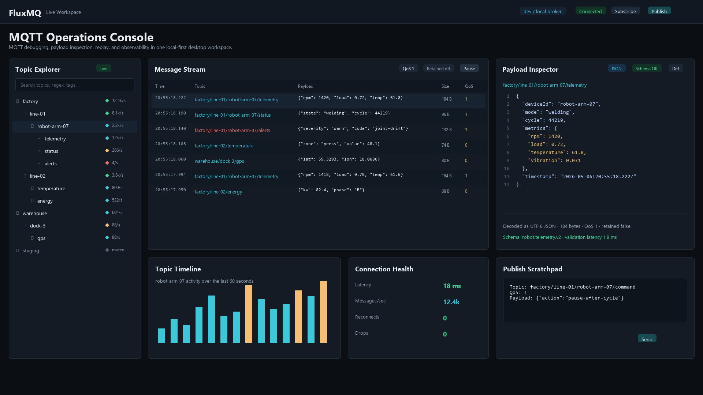
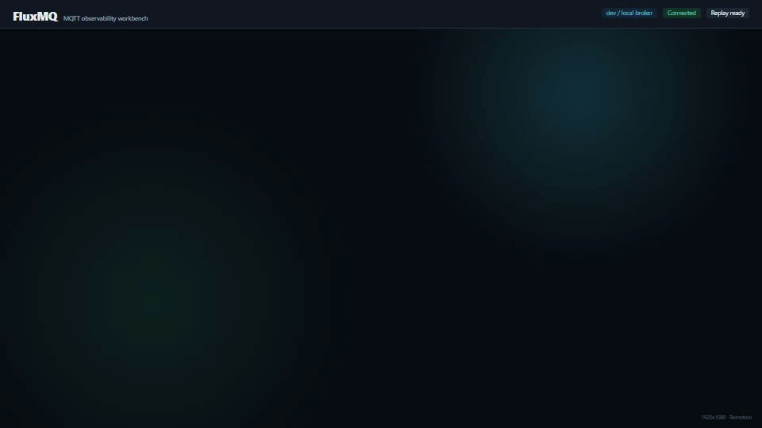
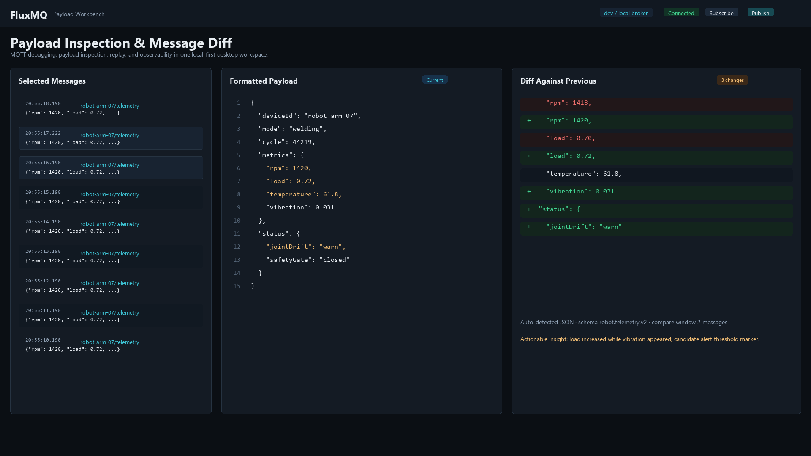
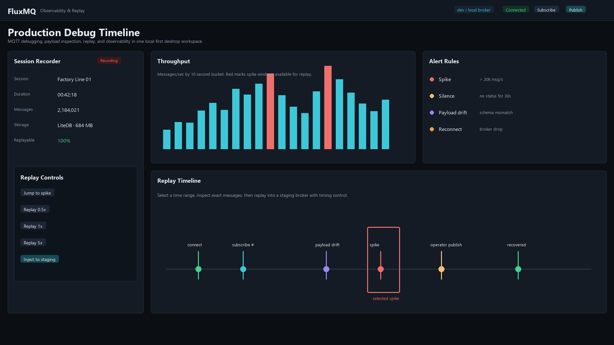

# FluxMQ

<p align="center">
  
</p>

FluxMQ is a next-generation MQTT debugging and observability platform built around a host-independent workflow runtime.

The long-term goal is to go beyond a passive MQTT client and provide a focused tool for:

- Exploring MQTT topic trees.
- Inspecting and decoding payloads.
- Recording and replaying message sessions.
- Observing broker and topic activity in real time.
- Extending the app through stable modules and, later, plugins.

## Status

FluxMQ is in early foundation work.

Current state:

- Core project structure in place.
- MQTTnet selected for MQTT integration.
- LiteDB selected for local-first storage.
- Test projects created for core, pipeline, replay, storage, app host, and CLI layers.
- Fork Flow application definition and cold-start runtime builder in place.
- `FluxMq.App` host boundary can load `FluxMq:FlowApplication` through .NET configuration.
- `FluxMq.Cli` can validate a flow application JSON file.
- Project memory and planning files tracked in `memory/`.

## Architecture Direction

FluxMQ will be built around the message/session flow first:

```text
MQTTnet Client
  -> FluxMqttClient
  -> Channel<MqttEnvelope>
  -> Flow Application Runtime
  -> Storage / Metrics / Topic Index
  -> UI Projection / Host Integration
```

Formal external plugins are planned later. The first implementation will use internal modules for payload inspection, observability, and replay so the extension contracts can mature naturally.

## Visual Direction

FluxMQ is aiming for an IDE-like desktop workspace: dense, operational, and optimized for repeated debugging work rather than a marketing-style interface.

### Intro Animation



### Mockups



Observability and replay timeline:



## Repository Layout

```text
/src
  /FluxMq.App
  /FluxMq.Cli
  /FluxMq.Core
  /FluxMq.Pipeline
  /FluxMq.Replay
  /FluxMq.Storage
  /FluxMq.UI
/tests
  /FluxMq.App.Tests
  /FluxMq.Cli.Tests
  /FluxMq.Core.Tests
  /FluxMq.Pipeline.Tests
  /FluxMq.Replay.Tests
  /FluxMq.Storage.Tests
/docs
/docs-site
/eng
/installer
/memory
```

## Requirements

- .NET SDK compatible with the repo's `global.json`.

The current development environment uses .NET 11 preview SDK to build .NET 10 projects.

## Build

```powershell
dotnet restore FluxMq.sln
dotnet build FluxMq.sln --no-restore
dotnet test FluxMq.sln --no-build
```

Validate the first sample flow application:

```powershell
dotnet run --project src\FluxMq.Cli -- validate --config samples\flow-applications\metrics-only.json
```

Use JSON output when the command is consumed by scripts or CI:

```powershell
dotnet run --project src\FluxMq.Cli -- validate --config samples\flow-applications\metrics-only.json --output json
```

Run the same flow application for a bounded smoke test:

```powershell
dotnet run --project src\FluxMq.Cli -- run --config samples\flow-applications\metrics-only.json --duration-ms 1000
```

## Windows Packages

The Windows desktop packaging workflow builds:

- `FluxMQ-<version>-portable-win-x64.zip`
- `FluxMQ-<version>-win-x64.msi`

The reusable local packaging entry point is:

```powershell
dotnet tool install --global wix --version 6.0.2
.\eng\package-windows.ps1 -Configuration Release -Version 0.1.0
```

## Project Memory

Planning, decisions, roadmap, and progress are tracked in `memory/`.

Start here:

- [Memory Index](memory/00-index.md)
- [Decisions](memory/01-decisions.md)
- [Architecture Plan](memory/02-architecture-plan.md)
- [Roadmap](memory/03-roadmap.md)
- [Progress Log](memory/04-progress-log.md)

## Documentation

Developer and architecture documentation is tracked in `docs/`.

User-facing documentation is tracked in `docs-site/` and published as a static GitHub Pages site.

Start here:

- [Documentation Index](docs/README.md)
- [Documentation Strategy](docs/documentation-strategy.md)
- [Architecture](docs/architecture.md)
- [Fork Flow](docs/fork-flow.md)
- [Flow Components](docs/flow-components.md)
- [Flow Errors](docs/flow-errors.md)
- [Replay](docs/replay.md)

## License

License is not decided yet.
