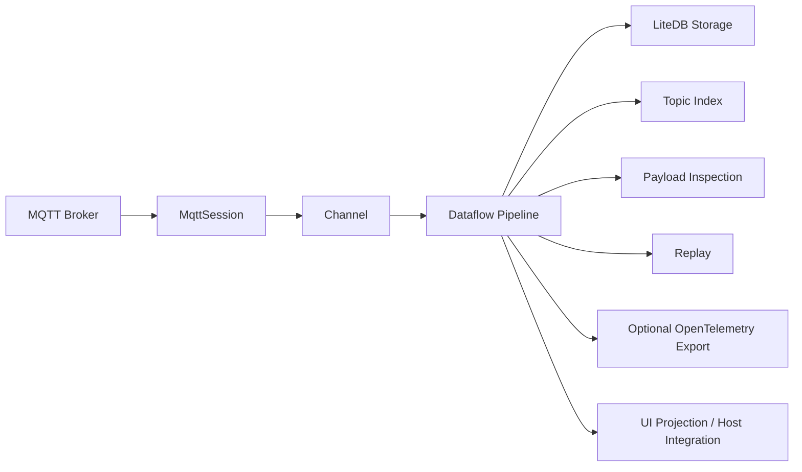
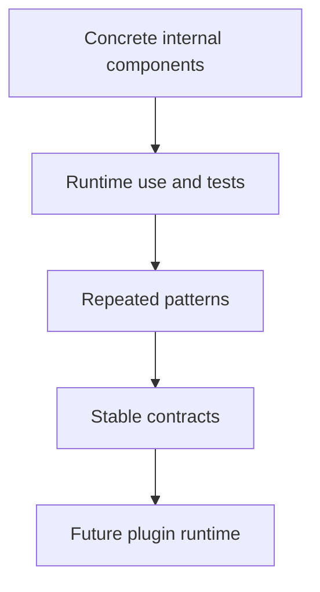
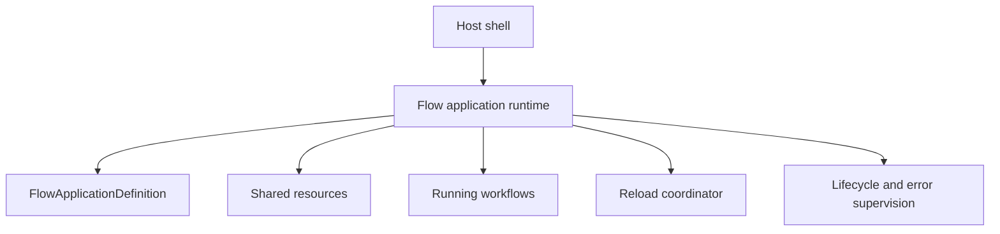

# Architecture

FluxMQ is built around MQTT message/session flow.



## Projects

### FluxMq.Core

Core domain and MQTT behavior.

Responsibilities:

- typed IDs
- connection profiles
- MQTT envelopes
- session lifecycle
- connection management
- topic index
- payload inspection

### FluxMq.Pipeline

Dataflow-based message movement and Fork Flow components.

Responsibilities:

- message pipeline foundation
- concrete flow components
- lifecycle behavior
- flow error events
- replay source behavior
- local metrics projection components

### FluxMq.Replay

Recorded session replay orchestration.

Responsibilities:

- load stored session messages through storage repositories
- convert stored messages into MQTT envelopes
- create configured replay source components
- keep replay orchestration separate from both storage and primitive pipeline components

### FluxMq.Storage

LiteDB persistence.

Responsibilities:

- connection profiles
- sessions
- stored messages
- repository layer

### FluxMq.App

Host-independent workflow application boundary.

Responsibilities:

- load flow application definitions from .NET configuration
- build runtimes through registered factories
- expose start and stop lifecycle
- keep the future reload boundary outside UI shells
- provide the composition point for desktop, console, service, and tool hosts

### FluxMq.UI

Reusable UI components.

Responsibilities:

- topic tree
- payload inspector panel
- future replay and observability UI pieces

## Observability Direction

FluxMQ has two observability layers:

- Local flow metrics for the desktop app.
- Planned OpenTelemetry export for external monitoring tools.

Local metrics must work without external infrastructure. Components such as `MqttMetricsSinkComponent` provide deterministic metric snapshots for UI projection and Fork Flow composition.

OpenTelemetry should be added later as an optional export layer. It should publish selected counters, traces, and diagnostic events without replacing local flow components.

Design constraints:

- Keep OpenTelemetry optional.
- Avoid raw MQTT topic values as high-cardinality attributes by default.
- Prefer stable dimensions such as flow node ID, connection profile ID, session ID, and numeric flow error code.
- Define metric names, units, and attribute cardinality before adding exporters.

## Current Architectural Rule

Not every class is a flow component.

Normal services remain normal services:

- repositories
- storage context
- connection manager
- UI components
- app startup

Flow components are reserved for configurable event movement inside Fork Flow.

## Extension Direction

External plugins are not the MVP foundation. The current approach is:



## Fork Flow Definition Direction

Fork Flow is moving toward configuration-driven graph definitions.

The first definition layer describes a host-independent flow application in an object model:

- shared resources
- named workflows
- nodes as workflow object properties
- node types
- receiving-port links
- per-node configuration payloads

Validation runs before graph construction and catches broken references, empty names, empty node types, malformed links, and duplicate links.

Runtime graph building, component factories, schema metadata, and hot reload remain separate steps. This keeps the definition model useful without prematurely forcing all components into a large abstraction.

## Flow Application Runtime Direction

The long-term runtime should be packaged as a class library that can be hosted by a future FluxMQ application host, a console runner, a service process, or command/tool integrations.

The runtime controller should sit above individual workflow graphs and below the host shell:



The host asks the runtime to load, start, stop, or reload an application definition. The runtime validates the next definition, owns shared resource lifetime, starts workflows, propagates completion, converts component failures into flow errors, and applies reloads without making the UI shell responsible for graph mechanics.

The first implemented slice is cold-start graph building. `FlowApplicationRuntimeBuilder` creates runtime nodes through a factory registry and links declared ports through typed port adapters. It deliberately does not hard-code component construction into the builder; concrete component registrations can evolve as component configuration schemas become stable.

`FluxMq.App` now provides the first host boundary. `FlowApplicationHost` reads a `FlowApplicationDefinition` from .NET configuration, builds a runtime, exposes current state, starts the runtime boundary, and completes it on stop. The current default configuration section is `FluxMq:FlowApplication`.

Definition sources should remain configuration providers. A JSON file is the first alpha path, but the same host can later accept environment values, command-line values, LiteDB-backed providers, or UI-produced configuration without changing the runtime model.

`FluxMq.Cli` is planned as a lightweight host over the same `FluxMq.App` boundary. The first CLI slice should stay small, but it is an important future surface for running, validating, inspecting, and automating flow applications.

The initial CLI command is intentionally limited:

```powershell
dotnet run --project src/FluxMq.Cli -- validate --config samples/flow-applications/metrics-only.json
```

It validates the configured flow application through `FluxMq.App` and reports host, definition, and runtime build errors.
