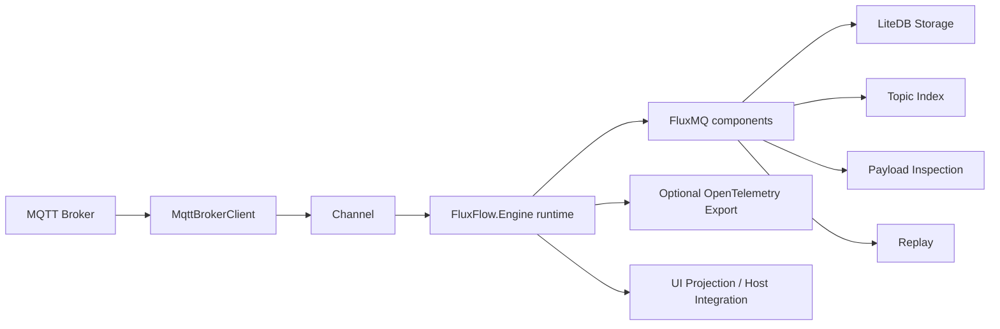
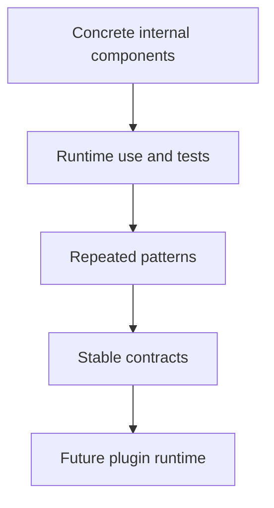
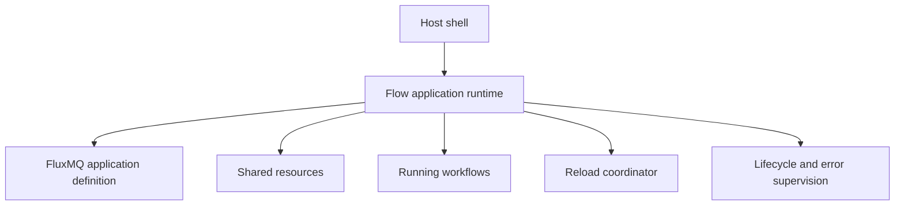
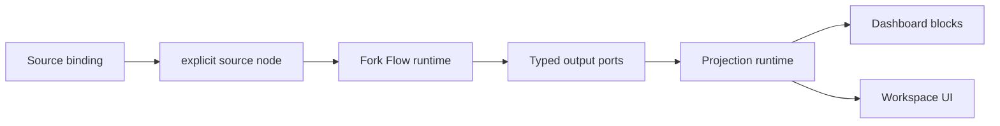

# Architecture

FluxMQ is built around MQTT message/session flow.



## Projects

### FluxMq.Core

Core domain and MQTT behavior.

Responsibilities:

- typed IDs
- connection profiles
- MQTT envelopes
- session lifecycle
- connection management
- topic index
- payload inspection

### FluxFlow.Engine Package

Package-owned workflow runtime primitives.

Responsibilities:

- application definition and workflow definition model
- runtime graph building
- typed runtime ports
- expression-engine abstractions for dynamic ELT mapping and link conditions
- lifecycle behavior
- flow error events
- package-owned validation for executable resources and workflows

### FluxMq.Components

Concrete flow components and local component services.

Responsibilities:

- MQTT connection and trigger components
- source adapters for live, stored, and generated MQTT traffic
- actor request contracts such as `MqttPublishRequest` and `FileWriteRequest`
- mapper adapters that turn source messages into actor requests when driven by `flow.mapper`
- replay source and recorded-session replay orchestration
- local metrics projection components
- LiteDB persistence and repositories
- load stored session messages through storage repositories
- convert stored messages into MQTT envelopes
- connection profiles
- sessions
- stored messages
- keep concrete component dependencies outside the package runtime

### FluxMq.App

Host-independent workflow application boundary.

Responsibilities:

- load FluxMQ application definitions from .NET configuration
- validate FluxMQ-owned dashboards/tests plus engine-owned resources/workflows
- project executable resources and workflows into `FluxFlow.Engine`
- build runtimes through registered factories
- expose start and stop lifecycle
- keep the future reload boundary outside UI shells
- provide the composition point for desktop, console, service, and tool hosts

### FluxMq.Scenarios

Scenario and test-runner primitives.

Responsibilities:

- scenario definitions and step results
- runner-owned MQTT publish/trigger steps
- event expectations and conditional test steps
- scenario event journal and report data
- keep tests outside the production workflow runtime contract

### FluxMq.UI

MAUI Blazor Hybrid desktop app and reusable UI components.

Responsibilities:

- live broker connection, subscribe, publish, topic, and payload inspection views
- visual Fork Flow definition workspace using Blazor.Diagrams
- user-facing Dynamic Mapper node configuration for explicit ELT type conversion
- file load/save for flow application definitions
- runtime validate, run, and stop controls through `FluxMq.App`
- reusable topic tree and payload inspector components
- future replay and observability UI pieces

## Observability Direction

FluxMQ has two observability layers:

- Local flow metrics for the desktop app.
- Planned OpenTelemetry export for external monitoring tools.

Local metrics must work without external infrastructure. Components such as `MqttMetricsComponent` provide deterministic metric snapshots for UI projection and Fork Flow composition.

OpenTelemetry should be added later as an optional export layer. It should publish selected counters, traces, and diagnostic events without replacing local flow components.

Design constraints:

- Keep OpenTelemetry optional.
- Avoid raw MQTT topic values as high-cardinality attributes by default.
- Prefer stable dimensions such as flow node ID, connection profile ID, session ID, and numeric flow error code.
- Define metric names, units, and attribute cardinality before adding exporters.

## Current Architectural Rule

Not every class is a flow component.

Normal services remain normal services:

- repositories
- storage context
- connection manager
- UI components
- app startup

Flow components are reserved for configurable event movement inside Fork Flow. Scenario/test steps live in `FluxMq.Scenarios` unless they are normal runtime components reused by tests.

## Extension Direction

External plugins are not the MVP foundation. The current approach is:



## Fork Flow Definition Direction

Fork Flow is moving toward configuration-driven graph definitions.

The package definition layer describes executable resources and workflows:

- shared resources
- named workflows
- nodes as workflow object properties
- node types
- receiving-port links
- per-link conditions
- per-node configuration payloads

FluxMQ wraps that engine definition in `FluxMqApplicationDefinition`, adding app-owned dashboards and tests. Validation runs before graph construction and catches broken references, empty names, empty node types, malformed links, duplicate links, invalid dashboard layout, and invalid scenario steps.

Runtime graph building, component factories, schema metadata, dashboard projection, scenario execution, and hot reload remain separate steps. This keeps the definition model useful without forcing all app features into the engine package.

Dynamic ELT mapping is explicit in the graph. Source and trigger nodes emit protocol/domain messages such as `MqttEnvelope`; actor nodes consume request contracts such as `MqttPublishRequest` or `FileWriteRequest`. When the port types differ, the user adds a `flow.mapper` node and configures the mapping engine and expressions. Request models are not standalone UI components, and FluxMQ should not insert hidden mappers automatically.

## Flow Application Runtime Direction

The workflow runtime is provided by the `FluxFlow.Engine` package and can be hosted by the FluxMQ desktop app, console runner, future service process, or command/tool integrations. MQTT publish/subscribe node execution is delegated to the `FluxFlow.Components.Mqtt` package through FluxMQ adapters that preserve app-level connection resources and domain message contracts. Runtime `flow.mapper` execution is delegated to the `FluxFlow.Components.Mapping` package, with a small FluxMQ expression adapter for app-specific request coercion such as MQTT QoS aliases. JSON Schema validation is delegated to `FluxFlow.Components.Validation`, with FluxMQ adapting MQTT payload selection, validation result shape, and product events.

The runtime controller should sit above individual workflow graphs and below the host shell:



The host asks the runtime boundary to load, start, stop, or reload an application definition. The engine owns executable graph validation, shared resource lifetime, workflow startup, typed links, completion propagation, and component failure events. FluxMQ owns app document features such as dashboards, tests, workspace UI state, and host-specific composition.

`FluxMq.UI` is the first desktop host for this boundary. It is a MAUI Blazor Hybrid app, so the Blazor workspace can use MudBlazor and Blazor.Diagrams while still connecting to local brokers and reading or writing local definition files through native desktop APIs.

The first implemented slice is cold-start graph building through the package `ApplicationRuntimeBuilder`. It creates runtime nodes through a factory registry and links declared ports through typed port adapters, including per-link `when` expressions. It deliberately does not hard-code component construction into the builder; concrete component registrations can evolve as component configuration schemas become stable.

Factory calls receive a `RuntimeNodeFactoryContext` with the node address, node definition, optional workflow name, and resource placement. That gives service-backed registrations enough information to distinguish shared resources from workflow nodes without adding host-specific code. Runtime startup uses `NodeDefinition.Phase`; lower phases start first across both resources and workflow nodes. Nodes that need startup work override `IFlowNode.StartAsync`, and disposal releases workflow nodes before shared resources so long-lived connections, stores, or sessions can remain available while dependent workflow nodes shut down.

`FluxMq.App` now provides the first host boundary. `FlowApplicationHost` reads a `FluxMqApplicationDefinition` from .NET configuration, projects it to the engine definition, builds a runtime, exposes current state, starts the runtime boundary, and completes it on stop. The current default configuration section is `FluxMq:FlowApplication`.

Definition sources should remain configuration providers. A JSON file is the first alpha path, but the same host can later accept environment values, command-line values, LiteDB-backed providers, or UI-produced configuration without changing the runtime model.

`FluxMq.Cli` is planned as a lightweight host over the same `FluxMq.App` boundary. The first CLI slice should stay small, but it is an important future surface for running, validating, inspecting, and automating flow applications.

The initial CLI command is intentionally limited:

```powershell
dotnet run --project src/FluxMq.Cli -- validate --config samples/flow-applications/metrics-only.json
```

It validates the configured flow application through `FluxMq.App` and reports host, definition, and runtime build errors. The default text output is meant for people. `--output json` is the first automation-friendly format for scripts, CI pipelines, and other tools.

The CLI also has an initial `run` command for the same file-backed application definition:

```powershell
dotnet run --project src/FluxMq.Cli -- run --config samples/flow-applications/metrics-only.json --duration-ms 1000
```

The current `run` command is a host lifecycle path: load, build, start, wait for cancellation or a bounded duration, and stop cleanly. Message-producing and service-backed behavior should come from registered components and resources rather than special CLI code.

CLI command execution should stay separate from output rendering. The command layer now uses `Spectre.Console.Cli` for parsing and dispatch, while result rendering stays in dedicated renderers for stable automation output.

## Source-Agnostic Update Direction

Live broker traffic and stored/offline traffic enter Fork Flow through the same runtime source shape.

Source nodes are explicit execution bindings. A workflow consumes a source output from `mqtt.trigger`, `session.source`, `generated.source`, replay, imported data, or future protocol sources. These source nodes expose `Output: MqttEnvelope` and `Errors: FlowError`.



Runtime and projection updates should be Dataflow-native. Public runtime/component/projection contracts should expose typed source blocks or typed runtime ports for updates, state changes, and errors. Channels can remain internal to hot producers such as MQTT intake, but they should be adapted to Dataflow at the runtime boundary.

`EventHandler` should not shape runtime architecture. It may remain as temporary UI glue, but UI state should ultimately come from projection state plus typed update streams.
