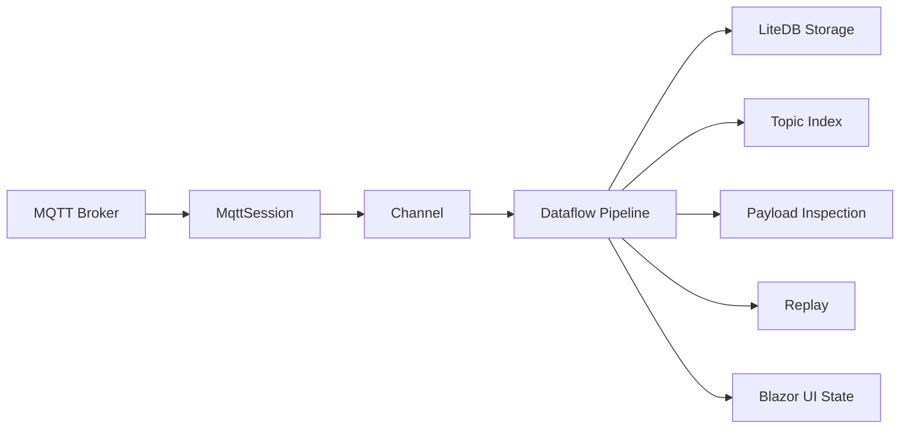
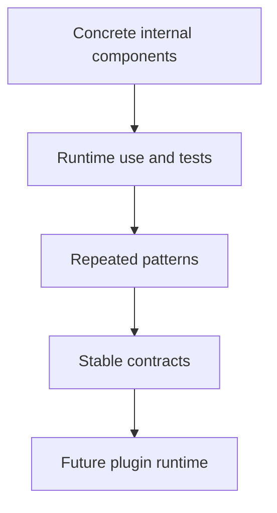

# Architecture

FluxMQ is built around MQTT message/session flow.

## Projects

### FluxMq.App

MAUI Blazor Hybrid shell.

Responsibilities:

- app startup
- dependency composition
- platform lifecycle
- main Blazor host

### FluxMq.Core

Core domain and MQTT behavior.

Responsibilities:

- typed IDs
- connection profiles
- MQTT envelopes
- session lifecycle
- connection management
- topic index
- payload inspection

### FluxMq.Pipeline

Dataflow-based message movement and Fork Flow components.

Responsibilities:

- message pipeline foundation
- concrete flow components
- lifecycle behavior
- flow error events
- replay source behavior

### FluxMq.Storage

LiteDB persistence.

Responsibilities:

- connection profiles
- sessions
- stored messages
- repository layer

### FluxMq.UI

Reusable Blazor components.

Responsibilities:

- topic tree
- payload inspector panel
- future replay and observability UI pieces

## Current Architectural Rule

Not every class is a flow component.

Normal services remain normal services:

- repositories
- storage context
- connection manager
- UI components
- app startup

Flow components are reserved for configurable event movement inside Fork Flow.

## Extension Direction

External plugins are not the MVP foundation. The current approach is:

