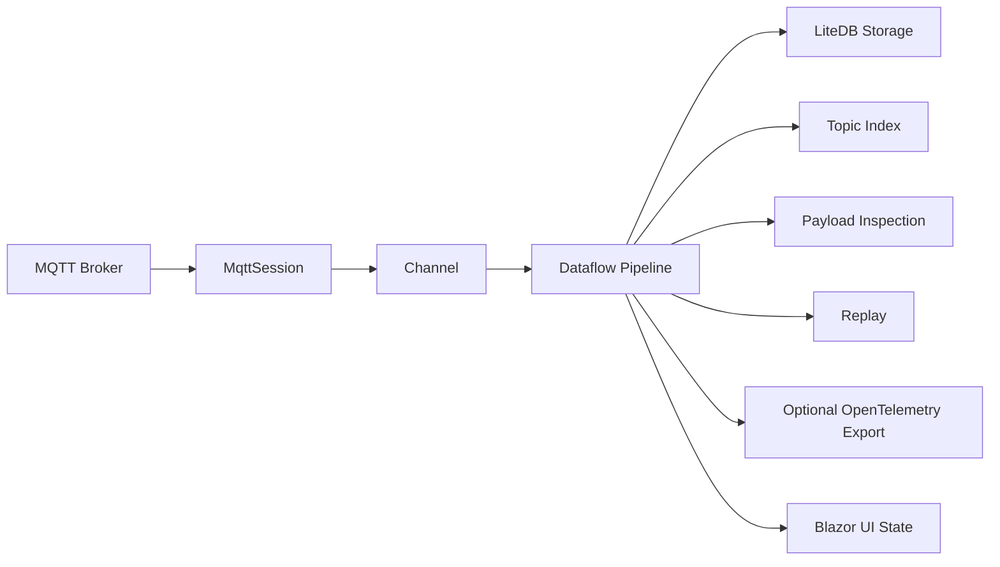
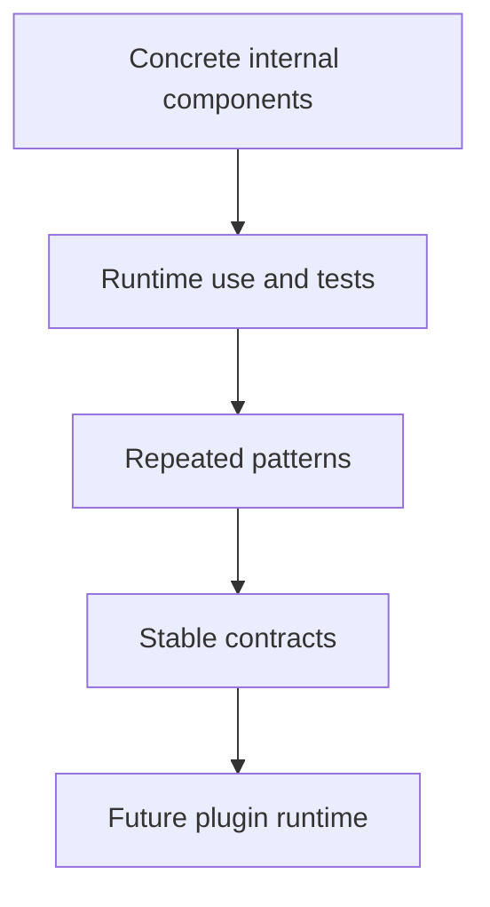

# Architecture

FluxMQ is built around MQTT message/session flow.

## Projects

### FluxMq.App

MAUI Blazor Hybrid shell.

Responsibilities:

- app startup
- dependency composition
- platform lifecycle
- main Blazor host

### FluxMq.Core

Core domain and MQTT behavior.

Responsibilities:

- typed IDs
- connection profiles
- MQTT envelopes
- session lifecycle
- connection management
- topic index
- payload inspection

### FluxMq.Pipeline

Dataflow-based message movement and Fork Flow components.

Responsibilities:

- message pipeline foundation
- concrete flow components
- lifecycle behavior
- flow error events
- replay source behavior
- local metrics projection components

### FluxMq.Replay

Recorded session replay orchestration.

Responsibilities:

- load stored session messages through storage repositories
- convert stored messages into MQTT envelopes
- create configured replay source components
- keep replay orchestration separate from both storage and primitive pipeline components

### FluxMq.Storage

LiteDB persistence.

Responsibilities:

- connection profiles
- sessions
- stored messages
- repository layer

### FluxMq.UI

Reusable Blazor components.

Responsibilities:

- topic tree
- payload inspector panel
- future replay and observability UI pieces

## Observability Direction

FluxMQ has two observability layers:

- Local flow metrics for the desktop app.
- Planned OpenTelemetry export for external monitoring tools.

Local metrics must work without external infrastructure. Components such as `MqttMetricsSinkComponent` provide deterministic metric snapshots for UI projection and Fork Flow composition.

OpenTelemetry should be added later as an optional export layer. It should publish selected counters, traces, and diagnostic events without replacing local flow components.

Design constraints:

- Keep OpenTelemetry optional.
- Avoid raw MQTT topic values as high-cardinality attributes by default.
- Prefer stable dimensions such as flow node ID, connection profile ID, session ID, and numeric flow error code.
- Define metric names, units, and attribute cardinality before adding exporters.

## Current Architectural Rule

Not every class is a flow component.

Normal services remain normal services:

- repositories
- storage context
- connection manager
- UI components
- app startup

Flow components are reserved for configurable event movement inside Fork Flow.

## Extension Direction

External plugins are not the MVP foundation. The current approach is:

