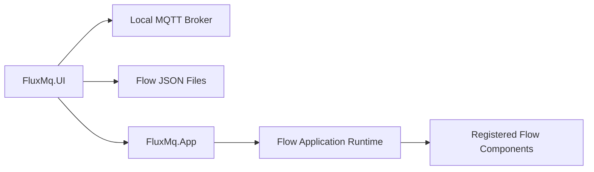

# Desktop App

`FluxMq.UI` is the first desktop workspace for FluxMQ.

It is a Windows-first MAUI Blazor Hybrid app. The Blazor surface uses MudBlazor for the app shell and Blazor.Diagrams for the first Fork Flow canvas, while the host process keeps native access to local files, LiteDB, and MQTT TCP connections.



## Current Alpha Surface

- broker profile editor
- connection test, connect, disconnect, subscribe, and publish actions
- live topic tree
- recent MQTT message list
- payload inspector
- LiteDB-backed live traffic recording controls
- component catalog for registered runtime nodes
- visual diagram projection from the flow application definition
- JSON definition editor
- definition save and load from local files
- validate, run, and stop controls through `FluxMq.App`

## Broker Assumption

The default profile points to:

```text
localhost:1883
```

This matches a default local Mosquitto service. The app should not require editing the broker configuration for the alpha path.

## Runtime Boundary

The desktop app does not own flow graph mechanics. It sends flow application definitions to `FluxMq.App`, which loads them through the .NET configuration model and builds the runtime through registered factories.

This keeps the same definition usable from the desktop app and the command-line host.
