# Flow Components

Flow components are the building blocks users will eventually place on a Fork Flow canvas.

This page documents the current Dataflow-backed components and shows how each behaves.

## Shared Shape

Current flow nodes expose:

- typed node identity through `FlowNodeId`
- Dataflow lifecycle through `Complete`, `Fault`, and `Completion`
- an `Errors` output port for `FlowError`
- component-specific input and output ports

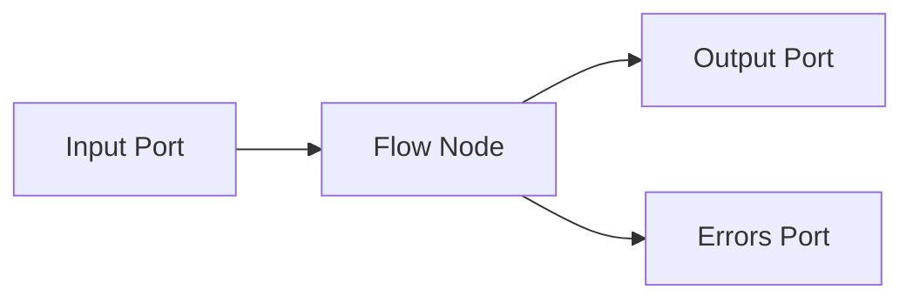

Not every component has an input port. Source and trigger components produce events.

## Connection State Trigger

`ConnectionStateTriggerComponent` converts connection manager state changes into flow events.

### Behavior

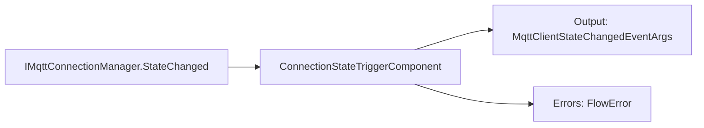

### Usage

```csharp
var trigger = new ConnectionStateTriggerComponent(connectionManager);

trigger.Output.LinkTo(stateSink, new DataflowLinkOptions
{
    PropagateCompletion = true
});
```

### Notes

- Use this when a flow should react to connection lifecycle events.
- Example downstream nodes: state router, notification actor, UI state projection.

## Source Components

Source nodes emit `MqttEnvelope` values through the same `Output` port, but each node type has one clear source responsibility.

Current source node types:

- `session.source`: streams messages from LiteDB by `SessionId`.
- `replay.source`: replays a stored session with configurable timing.
- `generated.source`: emits configured messages for deterministic tests and samples.

### Behavior

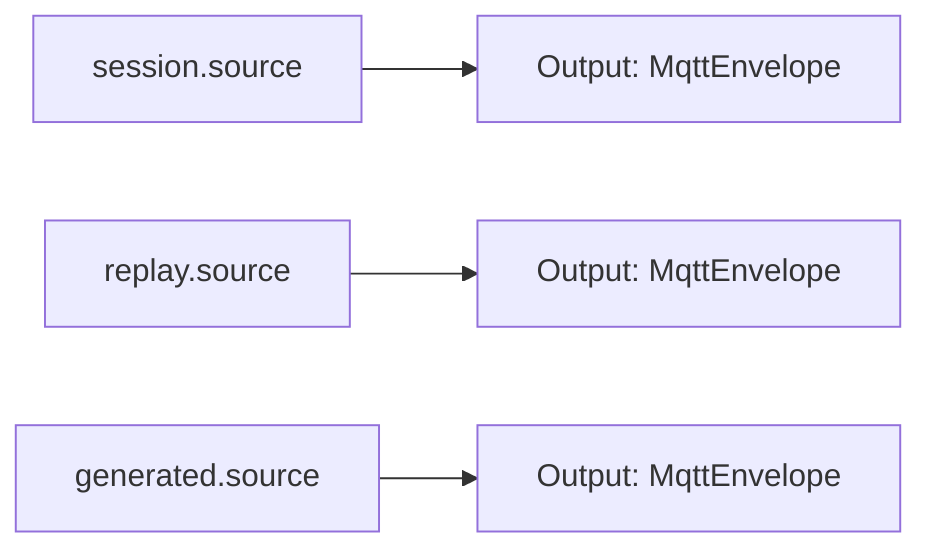

### Flow Definition

Registered workflow node types: `session.source`, `replay.source`, `generated.source`

Ports:

- `Output`: `MqttEnvelope`
- `Errors`: `FlowError`

Stored-session source:

```json
{
  "stored": {
    "type": "session.source",
    "configuration": {
      "sessionId": "00000000-0000-0000-0000-000000000001",
      "preserveTiming": false,
      "speed": 1
    }
  }
}
```

The stored-session mode requires the host to provide `IMessageRepository` when registering component factories.

## MQTT Connection and Trigger

`MqttConnectionComponent` owns the MQTT client lifecycle. `MqttTriggerComponent` references that shared connection, delegates subscription execution to the package MQTT subscribe node, and emits matching `MqttEnvelope` values.

### Behavior

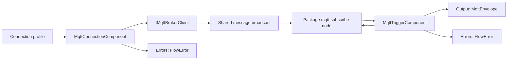

### Usage

```csharp
var connection = new MqttConnectionComponent(client, disposeClientOnDispose: false);
var trigger = new MqttTriggerComponent(connection,
[
    new MqttSubscription("factory/#", MqttQualityOfServiceLevel.AtMostOnce)
]);

trigger.Output.LinkTo(filter.Input, new DataflowLinkOptions
{
    PropagateCompletion = true
});

connection.Errors.LinkTo(errorSink);
trigger.Errors.LinkTo(errorSink);

await connection.StartAsync();
await trigger.StartAsync();
```

### Flow Definition

Registered resource node type: `mqtt.connection`

Ports:

- `Errors`: `FlowError`

Registered workflow node type: `mqtt.trigger`

Ports:

- `Output`: `MqttEnvelope`
- `Errors`: `FlowError`

```json
{
  "resources": {
    "broker": {
      "type": "mqtt.connection",
      "configuration": {
        "profile": {
          "name": "local-broker",
          "host": "localhost",
          "port": 1883
        }
      }
    }
  },
  "workflows": {
    "observeTraffic": {
      "trigger": {
        "type": "mqtt.trigger",
        "configuration": {
          "connection": "broker",
          "subscriptions": [
            "factory/#",
            { "topicFilter": "telemetry/#", "qos": "AtLeastOnce" }
          ],
          "boundedCapacity": 1000
        }
      }
    }
  }
}
```

The connection binding is configuration, not a dataflow link. This keeps the connection reusable across workflows while each trigger owns the topic filters that define when it emits messages.

### Failure Behavior

If the session reader fails, the connection publishes a `FlowError` and completes its broadcast. If subscription startup fails, the trigger publishes a `FlowError`; the application host turns startup failures into structured host errors instead of letting them escape the process boundary.

## Flow Filter

`flow.filter` forwards only matching input values. Runtime evaluation is package-backed by `FluxFlow.Components.Control`; FluxMQ adds only app-specific expression variables and node activity projection.

### Behavior

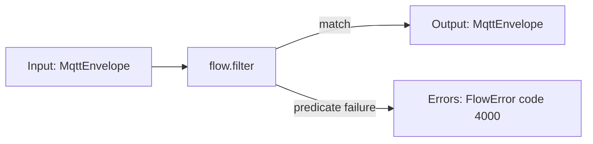

### Usage

```csharp
Configure `expression` to control which values pass.

source.LinkTo(filter.Input, new DataflowLinkOptions
{
    PropagateCompletion = true
});

filter.Output.LinkTo(next.Input, new DataflowLinkOptions
{
    PropagateCompletion = true
});
```

### Failure Behavior

If the predicate throws, the component publishes a `FlowError` and drops that message. Later messages continue processing.

## When Router

`flow.when` routes each input value to one of two output ports. Runtime evaluation is package-backed by `FluxFlow.Components.Control`; FluxMQ preserves route log entries for workspace observability.

Use it when non-matching messages should continue through a separate branch instead of being dropped.

### Behavior

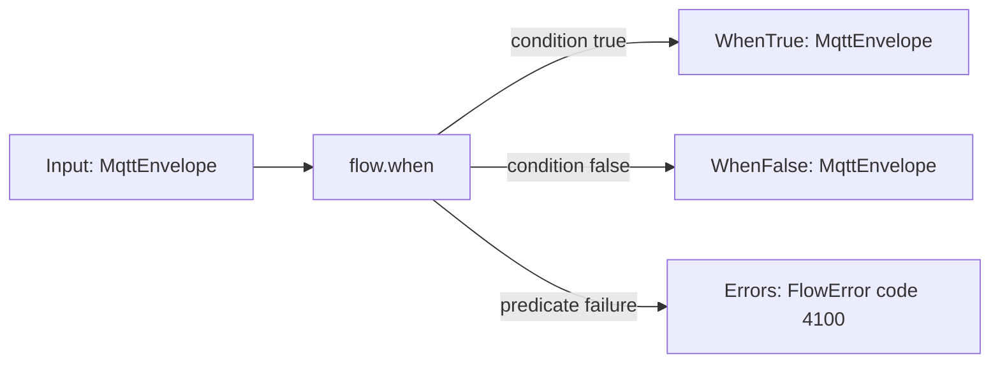

### Usage

```csharp
Configure `expression` to decide the branch.

source.Output.LinkTo(router.Input, new DataflowLinkOptions
{
    PropagateCompletion = true
});

router.WhenTrue.LinkTo(factorySink, new DataflowLinkOptions { PropagateCompletion = true });
router.WhenFalse.LinkTo(otherSink, new DataflowLinkOptions { PropagateCompletion = true });
router.Errors.LinkTo(errorSink);
```

### Failure Behavior

If the predicate throws, the component publishes a `FlowError` and drops that message. Later messages continue routing.

## Payload Inspector Mapper

`PayloadInspectorMapperComponent` maps raw MQTT messages into inspected payload messages.

Runtime classification is package-backed through `FluxFlow.Components.Payloads`. FluxMQ adapts each `MqttEnvelope` into a neutral payload inspection request, then projects the package inspection result back into the existing `InspectedMqttMessage` and Core payload model used by the UI.

### Behavior

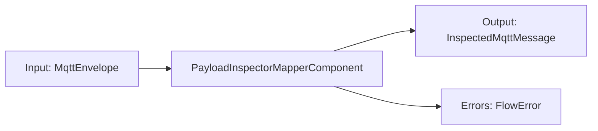

### Usage

```csharp
var mapper = new PayloadInspectorMapperComponent();

filter.Output.LinkTo(mapper.Input, new DataflowLinkOptions
{
    PropagateCompletion = true
});

mapper.Output.LinkTo(uiSink, new DataflowLinkOptions
{
    PropagateCompletion = true
});
```

### Flow Definition

Registered node type: `mqtt.payload-inspector`

Ports:

- `Input`: `MqttEnvelope`
- `Output`: `InspectedMqttMessage`
- `Errors`: `FlowError`

```json
{
  "inspect": {
    "type": "mqtt.payload-inspector",
    "Input": "source.Output"
  }
}
```

### Output

`InspectedMqttMessage` contains:

- original `MqttEnvelope`
- payload inspection result

## Replay Source

`ReplaySourceComponent` emits recorded MQTT messages in timestamp order.

### Behavior

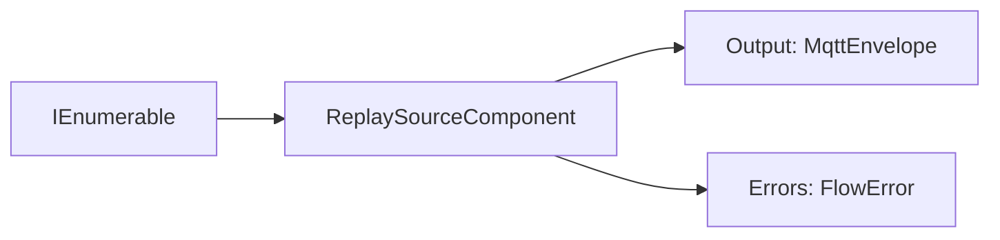

### Timing

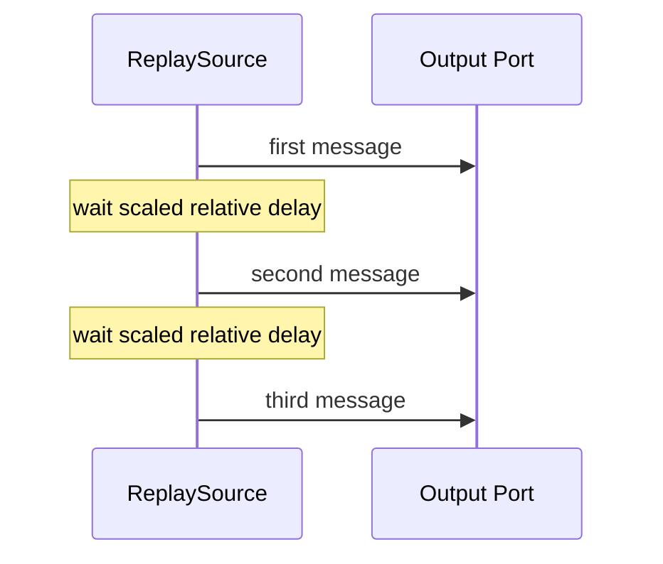

### Usage

```csharp
var replay = new ReplaySourceComponent(messages, speed: 2);

replay.Output.LinkTo(next.Input, new DataflowLinkOptions
{
    PropagateCompletion = true
});

await replay.StartAsync();
```

### Notes

- `speed = 1` preserves original relative timing.
- `speed = 2` replays twice as fast.
- delay behavior is injectable for deterministic tests.

## Dynamic Mapper

`flow.mapper` is the user-facing mapper node. It explicitly maps one typed input into the typed request object required by an actor. FluxMQ must not insert this node automatically: if `mqtt.trigger` emits `MqttEnvelope` and `mqtt.publisher` accepts `MqttPublishRequest`, the user adds a mapper between them and configures the mapping expressions.

Runtime execution is provided by the package-backed `flow.mapper` component. FluxMQ registers app-specific type aliases and an `MqttEnvelope` mapping context so existing mapper expressions can use variables such as `topic`, `payloadText`, `qos`, and `retain`.

The current FluxMQ mapper context supports `MqttEnvelope` input and these output request types:

- `MqttPublishRequest`
- `FileWriteRequest`
- `MqttRecordingRequest`

The mapper editor also records an output contract:

- `typed`: validate/coerce the expression result as the configured actor request type.
- `any`: preview the expression result as arbitrary JSON.
- `json-schema-file`: record the schema file that should validate the expression result.

Runtime execution uses the typed `outputType` path for actor wiring. JSON Schema validation is implemented as a standalone validator component so the same runtime capability can be reused by mapper hardening, ops checks, and future assertion nodes.

Supported mapper engines:

- `dynamic-expresso` for C#-style field expressions
- `jsonata` for JSONata field expressions over the envelope context

### Behavior

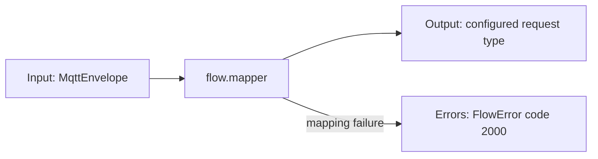

### Flow Definition

```json
{
  "mapper": {
    "type": "flow.mapper",
    "Input": "trigger.Output",
    "configuration": {
      "engine": "jsonata",
      "inputType": "MqttEnvelope",
      "outputType": "MqttPublishRequest",
      "outputContract": "typed",
      "expression": "{ \"topic\": \"mirror/\" & topic, \"payload\": \"mapped:\" & payloadText, \"qos\": 1, \"retain\": false }"
    }
  },
  "publisher": {
    "type": "mqtt.publisher",
    "Input": "mapper.Output",
    "configuration": {
      "connection": "broker2"
    }
  }
}
```

### Failure Behavior

If mapping fails for one message, the mapper publishes a `FlowError` and continues processing later messages.

## JSON Schema Validator

`json.schema-validator` validates MQTT payload JSON against an inline schema or a schema file. It is a standalone validator node, not hidden filter behavior and not owned by the mapper UI. Runtime schema loading and evaluation are package-backed by `FluxFlow.Components.Validation`; FluxMQ keeps the MQTT payload selector, `JsonSchemaValidationResult` shape, and validation events.

### Behavior

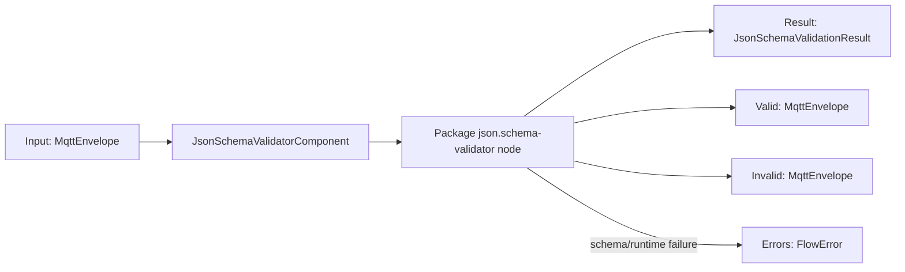

Invalid payloads produce `JsonSchemaValidationResult` values with `IsValid = false` and issue details. Processing failures publish `FlowError` and the component continues with later messages where possible.

### Flow Definition

```json
{
  "validator": {
    "type": "json.schema-validator",
    "Input": "source.Output",
    "configuration": {
      "schemaId": "status-schema",
      "schema": "{ \"type\": \"object\", \"required\": [\"status\"] }"
    }
  }
}
```

## MQTT Publisher

`MqttPublisherComponent` consumes `MqttPublishRequest` commands and delegates execution to the package MQTT publish node through an active MQTT client.

### Behavior

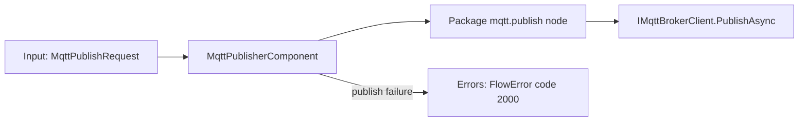

### Usage

```csharp
var publisher = new MqttPublisherComponent(session);

mapper.Output.LinkTo(publisher.Input, new DataflowLinkOptions
{
    PropagateCompletion = true
});

publisher.Errors.LinkTo(errorSink);
```

### Failure Behavior

If publishing fails for one request, the publisher publishes a `FlowError` with the topic in `Context` and continues processing later requests.

The component preserves publish order by default. Higher parallelism is available through the constructor, but ordered single-message publishing should remain the default for replay and deterministic flow behavior.

## File Writer

`FileWriterComponent` consumes `FileWriteRequest` commands and delegates disk writes to the package file write node. FluxMQ keeps the user-facing `file.writer` actor, `FileWriteRequest` mapper target, and `file.written` event projection.

### Behavior

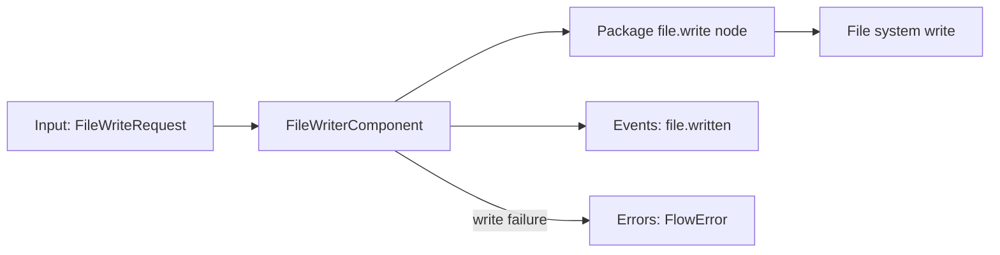

### Usage

```csharp
var writer = new FileWriterComponent();

mapper.Output.LinkTo(writer.Input, new DataflowLinkOptions
{
    PropagateCompletion = true
});

writer.Errors.LinkTo(errorSink);
writer.Events.LinkTo(eventSink);
```

### Failure Behavior

If a file write fails for one request, the package node publishes a structured `FlowError`, FluxMQ re-emits it from the `file.writer` node, and later requests continue processing.

## MQTT Recorder

`MqttRecorderComponent` stores incoming `MqttRecordingRequest` commands for a recording session.

This component lives in `FluxMq.Components` because it bridges flow nodes with storage repositories. The package runtime stays independent from storage and concrete component dependencies.

### Behavior

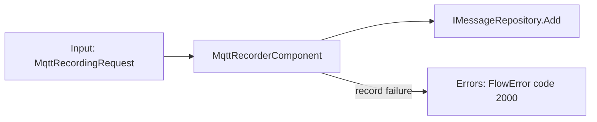

### Usage

```csharp
var recorder = new MqttRecorderComponent(messageRepository);

recordingMapper.Output.LinkTo(recorder.Input, new DataflowLinkOptions
{
    PropagateCompletion = true
});

recorder.Errors.LinkTo(errorSink);
```

### Failure Behavior

If a message cannot be stored, the recorder publishes a `FlowError` with the topic in `Context` and continues recording later messages.

## Flow Logger

`FlowLoggerComponent` observes MQTT messages and component errors. Neutral log-entry creation is package-backed by `FluxFlow.Components.Observability`; FluxMQ keeps the existing `flow.logger` node shape, MQTT/error projections, recent-entry buffer, and workspace log contract.

### Behavior

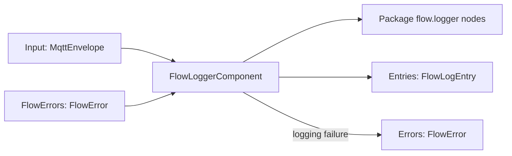

### Usage

```csharp
var logger = new FlowLoggerComponent(includePayloadPreview: true);

source.Output.LinkTo(logger.Input, new DataflowLinkOptions
{
    PropagateCompletion = true
});

source.Errors.LinkTo(logger.FlowErrors, new DataflowLinkOptions
{
    PropagateCompletion = true
});

logger.Entries.LinkTo(logSink);
```

### Flow Definition

Registered node type: `flow.logger`

Ports:

- `Input`: `MqttEnvelope`
- `FlowErrors`: `FlowError`
- `Entries`: `FlowLogEntry`
- `Errors`: `FlowError`

```json
{
  "logger": {
    "type": "flow.logger",
    "Input": "source.Output",
    "FlowErrors": "source.Errors",
    "configuration": {
      "includePayloadPreview": true
    }
  }
}
```

## MQTT Metrics

`MqttMetricsComponent` observes incoming MQTT messages and broadcasts immutable metric snapshots. It works only from its input stream; it does not care whether the data came from a live connection, replay, stored session, generated source, or imported source.

These snapshots are local flow data. The current node intentionally remains MQTT-specific because it tracks topic counts, retained messages, rolling-window rates, and MQTT payload sizes beyond the neutral package metrics contract. Planned OpenTelemetry support should export selected observability signals later without making this component depend on external collectors.

### Behavior

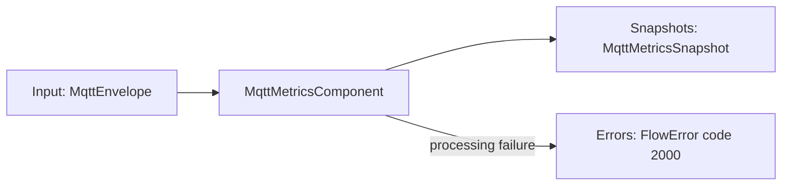

### Usage

```csharp
var metrics = new MqttMetricsComponent();

source.Output.LinkTo(metrics.Input, new DataflowLinkOptions
{
    PropagateCompletion = true
});

metrics.Snapshots.LinkTo(metricsUiSink);
metrics.Errors.LinkTo(errorSink);
```

### Flow Definition

Registered node type: `mqtt.metrics`

Ports:

- `Input`: `MqttEnvelope`
- `Snapshots`: `MqttMetricsSnapshot`
- `Errors`: `FlowError`

```json
{
  "metrics": {
    "type": "mqtt.metrics",
    "Input": "source.Output"
  }
}
```

### Snapshot

`MqttMetricsSnapshot` contains:

- message count
- total payload bytes
- minimum payload bytes
- maximum payload bytes
- retained message count
- unique topic count
- last topic
- last received timestamp
- average payload bytes

## Recorded Session Replay Factory

`RecordedSessionReplayFactory` creates replay sources from stored sessions.

This is not a flow node. It is an orchestration service.

### Behavior

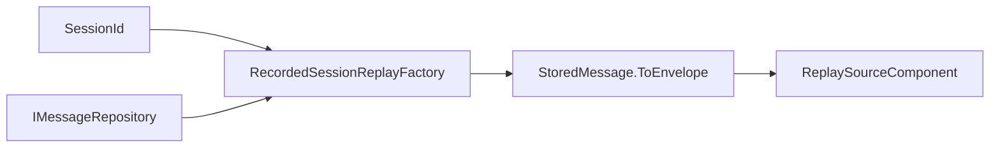

### Usage

```csharp
var factory = new RecordedSessionReplayFactory(messageRepository);
var replay = factory.Create(sessionId, new RecordedSessionReplayOptions
{
    Speed = 2
});
```

## Sample Flow

This flow reads traffic through a source, filters it, inspects payloads, and projects results to UI. The same downstream graph can run from live or stored traffic by choosing the appropriate source node.

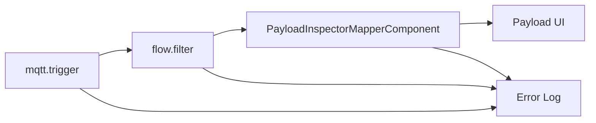

Equivalent workflow shape:

```json
{
  "trigger": { "type": "mqtt.trigger" },
  "filter": {
    "type": "flow.filter",
    "Input": "trigger.Output",
    "configuration": {
      "expression": "topic.StartsWith(\"factory/\")"
    }
  },
  "inspect": {
    "type": "mqtt.payload-inspector",
    "Input": "filter.Output"
  }
}
```

This flow branches live traffic into two paths.

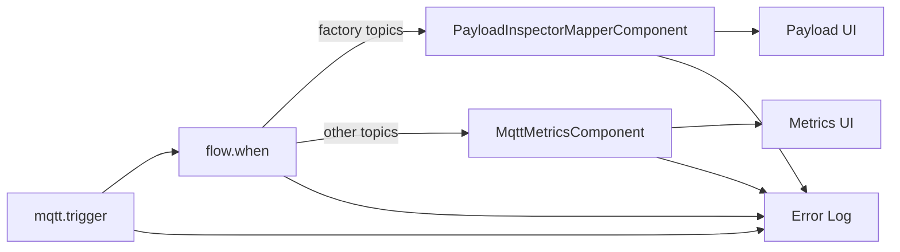

This flow records selected live traffic.

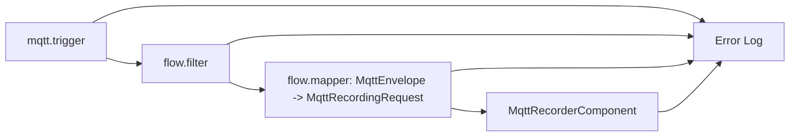

This flow replays a recorded session back through an MQTT client.

```mermaid
flowchart LR
    Factory["RecordedSessionReplayFactory"] --> Replay["ReplaySourceComponent"]
    Replay --> Filter["flow.filter"]
    Filter --> Mapper["flow.mapper: MqttEnvelope -> MqttPublishRequest"]
    Mapper --> Publisher["MqttPublisherComponent"]
    Replay --> ErrorLog["Error Log"]
    Filter --> ErrorLog
    Mapper --> ErrorLog
    Publisher --> ErrorLog
```

Equivalent definition shape:

```json
{
  "replay": { "type": "replay.source" },
  "filter": {
    "type": "flow.filter",
    "Input": "replay.Output"
  },
  "mapper": {
    "type": "flow.mapper",
    "Input": "filter.Output",
    "configuration": {
      "engine": "jsonata",
      "inputType": "MqttEnvelope",
      "outputType": "MqttPublishRequest",
      "map": {
        "topic": "topic",
        "payload": "payloadText",
        "qos": "qos",
        "retain": "retain"
      }
    }
  },
  "publisher": {
    "type": "mqtt.publisher",
    "Input": "mapper.Output"
  }
}
```

## Future Component Types

Dynamic mapper components should use `FlowError.Code` for routing and diagnostics instead of relying on exception message text. User-facing definitions should use `flow.mapper`; FluxMQ no longer keeps request-specific mapper node implementations.

OpenTelemetry support is planned as an observability export layer, not as a replacement for local flow components.
