# Flow Components

Flow components are the building blocks users will eventually place on a Fork Flow canvas.

This page documents the current Dataflow-backed components and shows how each behaves.

## Shared Shape

Current flow nodes expose:

- typed node identity through `FlowNodeId`
- Dataflow lifecycle through `Complete`, `Fault`, and `Completion`
- an `Errors` output port for `FlowError`
- component-specific input and output ports

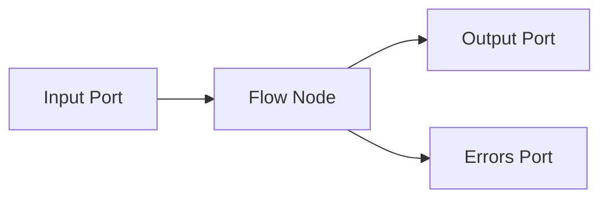

Not every component has an input port. Source and trigger components produce events.

## Connection State Trigger

`ConnectionStateTriggerComponent` converts connection manager state changes into flow events.

### Behavior

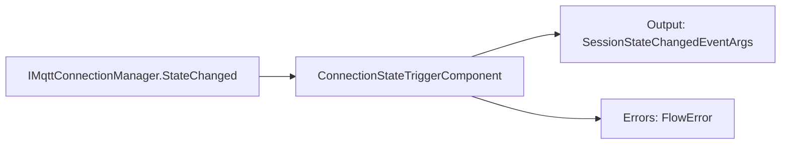

### Usage

```csharp
var trigger = new ConnectionStateTriggerComponent(connectionManager);

trigger.Output.LinkTo(stateSink, new DataflowLinkOptions
{
    PropagateCompletion = true
});
```

### Notes

- Use this when a flow should react to connection lifecycle events.
- Example downstream nodes: state router, notification sink, UI state projection.

## MQTT Connection and Trigger

`MqttConnectionComponent` owns the MQTT session lifecycle. `MqttTriggerComponent` references that shared connection, installs its own subscriptions, and emits matching `MqttEnvelope` values.

### Behavior

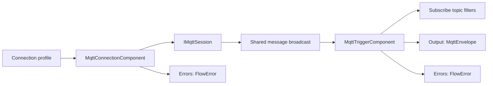

### Usage

```csharp
var connection = new MqttConnectionComponent(session, disposeSessionOnDispose: false);
var trigger = new MqttTriggerComponent(connection,
[
    new MqttSubscription("factory/#", MqttQualityOfServiceLevel.AtMostOnce)
]);

trigger.Output.LinkTo(filter.Input, new DataflowLinkOptions
{
    PropagateCompletion = true
});

connection.Errors.LinkTo(errorSink);
trigger.Errors.LinkTo(errorSink);

await connection.StartAsync();
await trigger.StartAsync();
```

### Flow Definition

Registered resource node type: `mqtt.connection`

Ports:

- `Errors`: `FlowError`

Registered workflow node type: `mqtt.trigger`

Ports:

- `Output`: `MqttEnvelope`
- `Errors`: `FlowError`

```json
{
  "resources": {
    "broker": {
      "type": "mqtt.connection",
      "configuration": {
        "profile": {
          "name": "local-broker",
          "host": "localhost",
          "port": 1883
        }
      }
    }
  },
  "workflows": {
    "observeTraffic": {
      "trigger": {
        "type": "mqtt.trigger",
        "configuration": {
          "connection": "broker",
          "subscriptions": [
            "factory/#",
            { "topicFilter": "telemetry/#", "qos": "AtLeastOnce" }
          ],
          "boundedCapacity": 1000
        }
      }
    }
  }
}
```

The connection binding is configuration, not a dataflow link. This keeps the connection reusable across workflows while each trigger owns the topic filters that define when it emits messages.

### Failure Behavior

If the session reader fails, the connection publishes a `FlowError` and completes its broadcast. If subscription startup fails, the trigger publishes a `FlowError`; the application host turns startup failures into structured host errors instead of letting them escape the process boundary.

## Topic Filter

`TopicFilterComponent` forwards only matching MQTT messages.

### Behavior

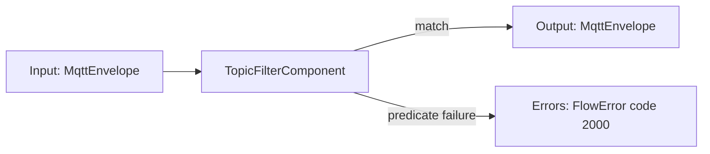

### Usage

```csharp
var filter = TopicFilterComponent.Prefix("factory/");

source.LinkTo(filter.Input, new DataflowLinkOptions
{
    PropagateCompletion = true
});

filter.Output.LinkTo(next.Input, new DataflowLinkOptions
{
    PropagateCompletion = true
});
```

### Failure Behavior

If the predicate throws, the component publishes a `FlowError` and drops that message. Later messages continue processing.

## MQTT Condition Router

`MqttConditionRouterComponent` routes each MQTT message to one of two output ports.

Use it when non-matching messages should continue through a separate branch instead of being dropped.

### Behavior

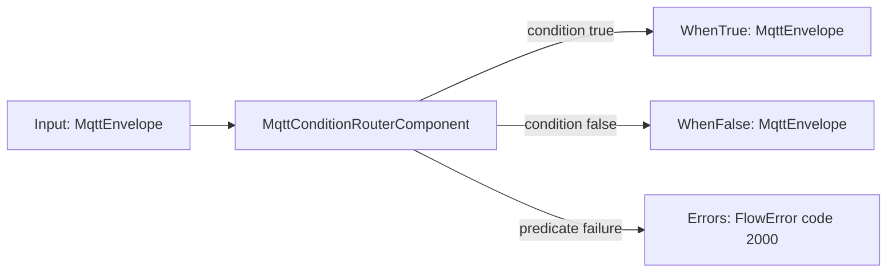

### Usage

```csharp
var router = MqttConditionRouterComponent.TopicPrefix("factory/");

source.Output.LinkTo(router.Input, new DataflowLinkOptions
{
    PropagateCompletion = true
});

router.WhenTrue.LinkTo(factorySink, new DataflowLinkOptions { PropagateCompletion = true });
router.WhenFalse.LinkTo(otherSink, new DataflowLinkOptions { PropagateCompletion = true });
router.Errors.LinkTo(errorSink);
```

### Failure Behavior

If the predicate throws, the component publishes a `FlowError` and drops that message. Later messages continue routing.

## Payload Inspector Mapper

`PayloadInspectorMapperComponent` maps raw MQTT messages into inspected payload messages.

### Behavior

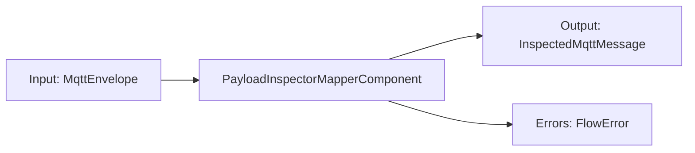

### Usage

```csharp
var mapper = new PayloadInspectorMapperComponent();

filter.Output.LinkTo(mapper.Input, new DataflowLinkOptions
{
    PropagateCompletion = true
});

mapper.Output.LinkTo(uiSink, new DataflowLinkOptions
{
    PropagateCompletion = true
});
```

### Flow Definition

Registered node type: `mqtt.payload-inspector`

Ports:

- `Input`: `MqttEnvelope`
- `Output`: `InspectedMqttMessage`
- `Errors`: `FlowError`

```json
{
  "inspect": {
    "type": "mqtt.payload-inspector",
    "Input": "source.Output"
  }
}
```

### Output

`InspectedMqttMessage` contains:

- original `MqttEnvelope`
- payload inspection result

## Replay Source

`ReplaySourceComponent` emits recorded MQTT messages in timestamp order.

### Behavior

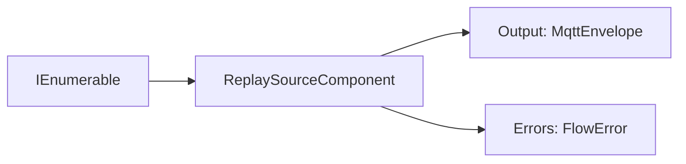

### Timing

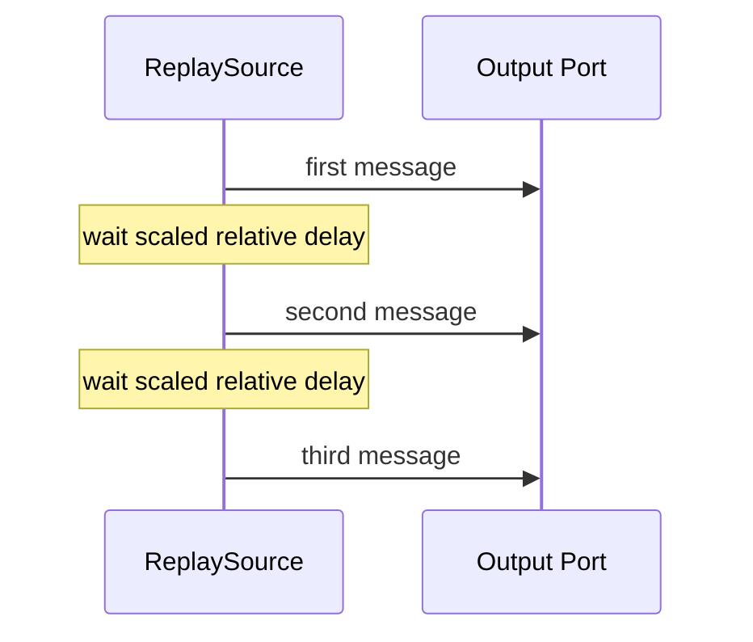

### Usage

```csharp
var replay = new ReplaySourceComponent(messages, speed: 2);

replay.Output.LinkTo(next.Input, new DataflowLinkOptions
{
    PropagateCompletion = true
});

await replay.StartAsync();
```

### Notes

- `speed = 1` preserves original relative timing.
- `speed = 2` replays twice as fast.
- delay behavior is injectable for deterministic tests.

## MQTT Publish Sink

`MqttPublishSinkComponent` publishes incoming MQTT messages through an active session.

### Behavior

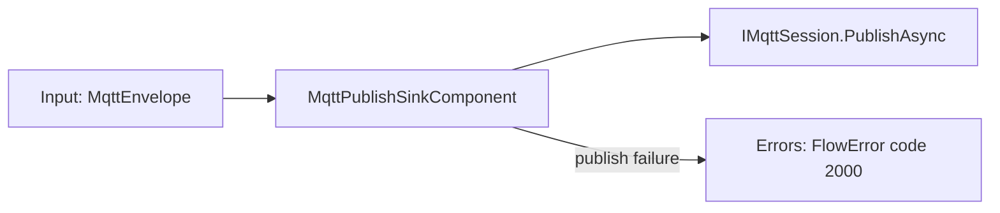

### Usage

```csharp
var publishSink = new MqttPublishSinkComponent(session);

source.LinkTo(publishSink.Input, new DataflowLinkOptions
{
    PropagateCompletion = true
});

publishSink.Errors.LinkTo(errorSink);
```

### Failure Behavior

If publishing fails for one message, the sink publishes a `FlowError` with the topic in `Context` and continues processing later messages.

The component preserves publish order by default. Higher parallelism is available through the constructor, but ordered single-message publishing should remain the default for replay and deterministic flow behavior.

## MQTT Recording Sink

`MqttRecordingSinkComponent` stores incoming MQTT messages for a recording session.

This component lives in `FluxMq.Replay` because it bridges flow nodes with storage repositories. `FluxMq.Pipeline` stays independent from storage.

### Behavior

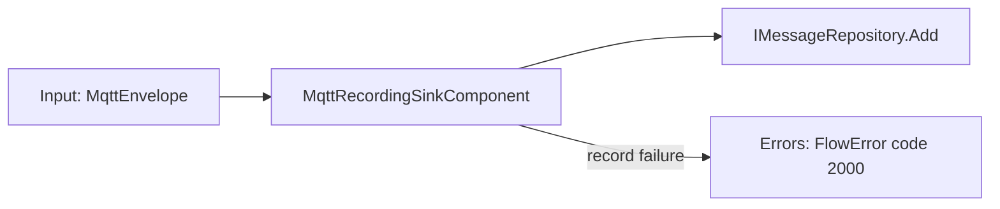

### Usage

```csharp
var recordingSink = new MqttRecordingSinkComponent(messageRepository, sessionId);

source.Output.LinkTo(recordingSink.Input, new DataflowLinkOptions
{
    PropagateCompletion = true
});

recordingSink.Errors.LinkTo(errorSink);
```

### Failure Behavior

If a message cannot be stored, the sink publishes a `FlowError` with the topic in `Context` and continues recording later messages.

## MQTT Metrics Sink

`MqttMetricsSinkComponent` tracks operational counters from incoming MQTT messages and broadcasts immutable snapshots.

These snapshots are local flow data. Planned OpenTelemetry support should export selected observability signals later without making this component depend on external collectors.

### Behavior

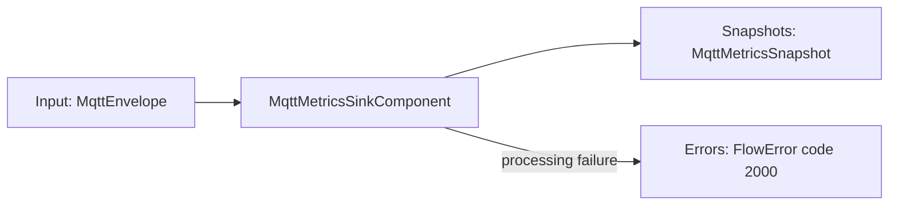

### Usage

```csharp
var metrics = new MqttMetricsSinkComponent();

source.Output.LinkTo(metrics.Input, new DataflowLinkOptions
{
    PropagateCompletion = true
});

metrics.Snapshots.LinkTo(metricsUiSink);
metrics.Errors.LinkTo(errorSink);
```

### Flow Definition

Registered node type: `mqtt.metrics-sink`

Ports:

- `Input`: `MqttEnvelope`
- `Snapshots`: `MqttMetricsSnapshot`
- `Errors`: `FlowError`

```json
{
  "metrics": {
    "type": "mqtt.metrics-sink",
    "Input": "source.Output"
  }
}
```

### Snapshot

`MqttMetricsSnapshot` contains:

- message count
- total payload bytes
- minimum payload bytes
- maximum payload bytes
- retained message count
- unique topic count
- last topic
- last received timestamp
- average payload bytes

## Recorded Session Replay Factory

`RecordedSessionReplayFactory` creates replay sources from stored sessions.

This is not a flow node. It is an orchestration service.

### Behavior

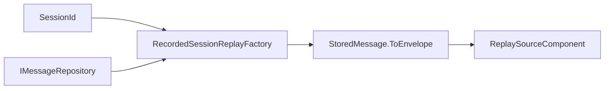

### Usage

```csharp
var factory = new RecordedSessionReplayFactory(messageRepository);
var replay = factory.Create(sessionId, new RecordedSessionReplayOptions
{
    Speed = 2
});
```

## Sample Flow

This flow reads live MQTT traffic through a shared connection, filters it, inspects payloads, and projects results to UI.

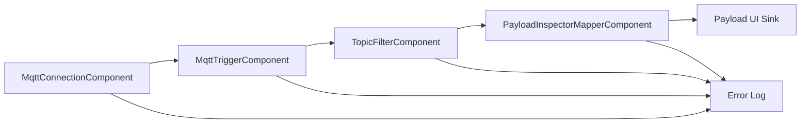

Equivalent code shape:

```csharp
var connection = new MqttConnectionComponent(session);
var trigger = new MqttTriggerComponent(connection,
[
    new MqttSubscription("factory/#", MqttQualityOfServiceLevel.AtMostOnce)
]);
var filter = TopicFilterComponent.Prefix("factory/");
var mapper = new PayloadInspectorMapperComponent();

trigger.Output.LinkTo(filter.Input, new DataflowLinkOptions { PropagateCompletion = true });
filter.Output.LinkTo(mapper.Input, new DataflowLinkOptions { PropagateCompletion = true });
mapper.Output.LinkTo(payloadUiSink, new DataflowLinkOptions { PropagateCompletion = true });

connection.Errors.LinkTo(errorSink);
trigger.Errors.LinkTo(errorSink);
filter.Errors.LinkTo(errorSink);
mapper.Errors.LinkTo(errorSink);

await connection.StartAsync();
await trigger.StartAsync();
```

This flow branches live traffic into two paths.

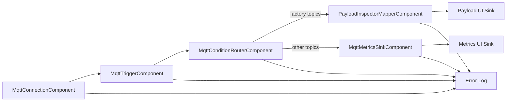

This flow records selected live traffic.

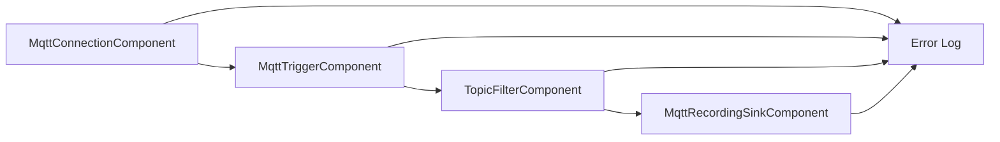

This flow replays a recorded session back through an MQTT session.

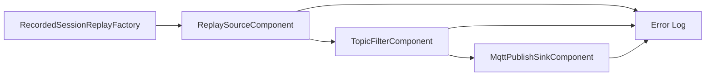

Equivalent code shape:

```csharp
var replay = replayFactory.Create(sessionId);
var filter = TopicFilterComponent.Prefix("factory/");
var publishSink = new MqttPublishSinkComponent(session);

replay.Output.LinkTo(filter.Input, new DataflowLinkOptions { PropagateCompletion = true });
filter.Output.LinkTo(publishSink.Input, new DataflowLinkOptions { PropagateCompletion = true });

replay.Errors.LinkTo(errorSink);
filter.Errors.LinkTo(errorSink);
publishSink.Errors.LinkTo(errorSink);

await replay.StartAsync();
await publishSink.Completion;
```

## Future Component Types

Likely near-term additions:

- dynamic expression mapper
- JSONata mapper

Dynamic expression components should use `FlowError.Code` for routing and diagnostics instead of relying on exception message text.

OpenTelemetry support is planned as an observability export layer, not as a replacement for local flow components.
