# Flow Components

Flow components are the building blocks users will eventually place on a Fork Flow canvas.

This page documents the current Dataflow-backed components and shows how each behaves.

## Shared Shape

Current flow nodes expose:

- typed node identity through `FlowNodeId`
- Dataflow lifecycle through `Complete`, `Fault`, and `Completion`
- an `Errors` output port for `FlowError`
- component-specific input and output ports

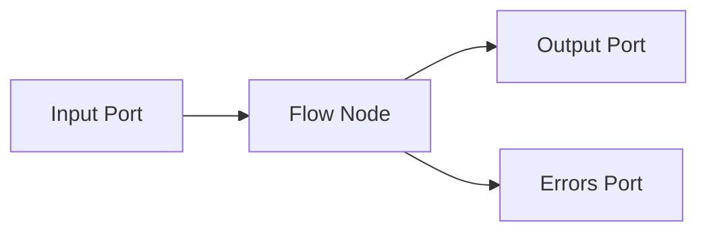

Not every component has an input port. Source and trigger components produce events.

## Connection State Trigger

`ConnectionStateTriggerComponent` converts connection manager state changes into flow events.

### Behavior

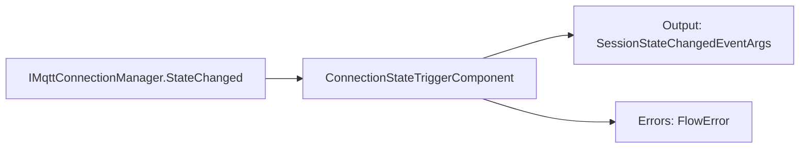

### Usage

```csharp
var trigger = new ConnectionStateTriggerComponent(connectionManager);

trigger.Output.LinkTo(stateSink, new DataflowLinkOptions
{
    PropagateCompletion = true
});
```

### Notes

- Use this when a flow should react to connection lifecycle events.
- Example downstream nodes: state router, notification sink, UI state projection.

## MQTT Message Source

`MqttMessageSourceComponent` converts an active MQTT session message channel into a flow source.

### Behavior

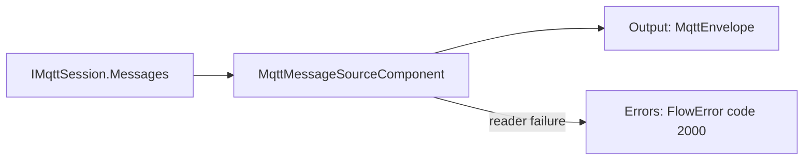

### Usage

```csharp
var source = new MqttMessageSourceComponent(session);

source.Output.LinkTo(filter.Input, new DataflowLinkOptions
{
    PropagateCompletion = true
});

source.Errors.LinkTo(errorSink);

await source.StartAsync();
```

### Failure Behavior

If the session reader fails, the component publishes a `FlowError` and completes its output. The application host decides whether to reconnect, rebuild the flow, or surface the failure to the user.

## Topic Filter

`TopicFilterComponent` forwards only matching MQTT messages.

### Behavior

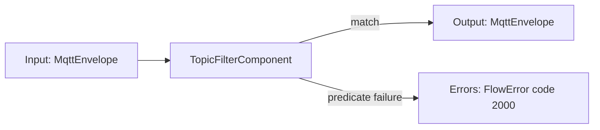

### Usage

```csharp
var filter = TopicFilterComponent.Prefix("factory/");

source.LinkTo(filter.Input, new DataflowLinkOptions
{
    PropagateCompletion = true
});

filter.Output.LinkTo(next.Input, new DataflowLinkOptions
{
    PropagateCompletion = true
});
```

### Failure Behavior

If the predicate throws, the component publishes a `FlowError` and drops that message. Later messages continue processing.

## Payload Inspector Mapper

`PayloadInspectorMapperComponent` maps raw MQTT messages into inspected payload messages.

### Behavior

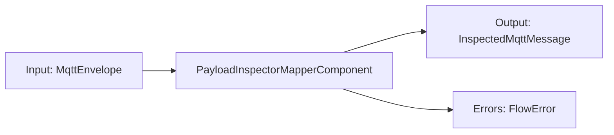

### Usage

```csharp
var mapper = new PayloadInspectorMapperComponent();

filter.Output.LinkTo(mapper.Input, new DataflowLinkOptions
{
    PropagateCompletion = true
});

mapper.Output.LinkTo(uiSink, new DataflowLinkOptions
{
    PropagateCompletion = true
});
```

### Output

`InspectedMqttMessage` contains:

- original `MqttEnvelope`
- payload inspection result

## Replay Source

`ReplaySourceComponent` emits recorded MQTT messages in timestamp order.

### Behavior

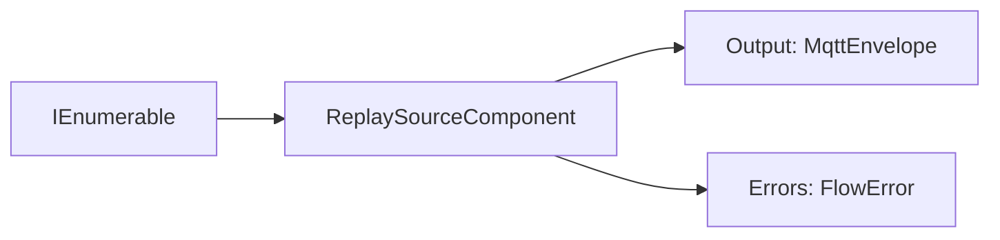

### Timing

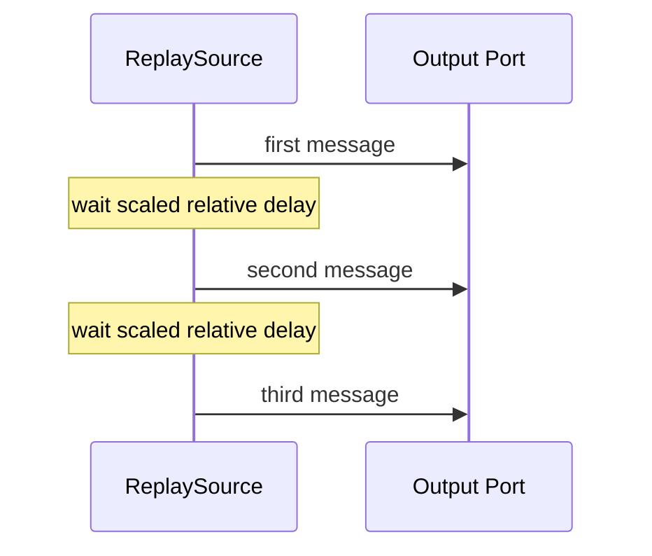

### Usage

```csharp
var replay = new ReplaySourceComponent(messages, speed: 2);

replay.Output.LinkTo(next.Input, new DataflowLinkOptions
{
    PropagateCompletion = true
});

await replay.StartAsync();
```

### Notes

- `speed = 1` preserves original relative timing.
- `speed = 2` replays twice as fast.
- delay behavior is injectable for deterministic tests.

## MQTT Publish Sink

`MqttPublishSinkComponent` publishes incoming MQTT messages through an active session.

### Behavior

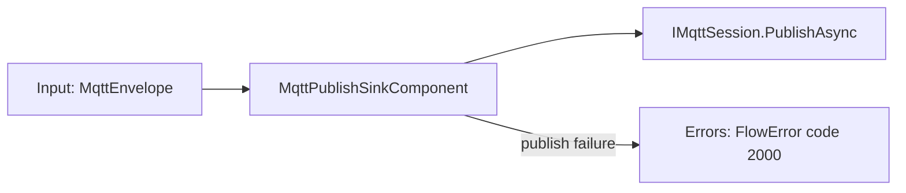

### Usage

```csharp
var publishSink = new MqttPublishSinkComponent(session);

source.LinkTo(publishSink.Input, new DataflowLinkOptions
{
    PropagateCompletion = true
});

publishSink.Errors.LinkTo(errorSink);
```

### Failure Behavior

If publishing fails for one message, the sink publishes a `FlowError` with the topic in `Context` and continues processing later messages.

The component preserves publish order by default. Higher parallelism is available through the constructor, but ordered single-message publishing should remain the default for replay and deterministic flow behavior.

## Recorded Session Replay Factory

`RecordedSessionReplayFactory` creates replay sources from stored sessions.

This is not a flow node. It is an orchestration service.

### Behavior

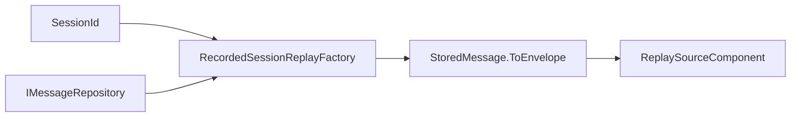

### Usage

```csharp
var factory = new RecordedSessionReplayFactory(messageRepository);
var replay = factory.Create(sessionId, new RecordedSessionReplayOptions
{
    Speed = 2
});
```

## Sample Flow

This flow reads a live MQTT session, filters it, inspects payloads, and projects results to UI.

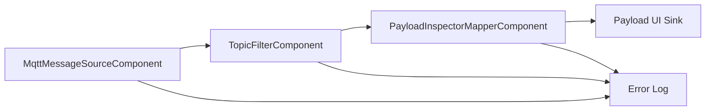

Equivalent code shape:

```csharp
var source = new MqttMessageSourceComponent(session);
var filter = TopicFilterComponent.Prefix("factory/");
var mapper = new PayloadInspectorMapperComponent();

source.Output.LinkTo(filter.Input, new DataflowLinkOptions { PropagateCompletion = true });
filter.Output.LinkTo(mapper.Input, new DataflowLinkOptions { PropagateCompletion = true });
mapper.Output.LinkTo(payloadUiSink, new DataflowLinkOptions { PropagateCompletion = true });

source.Errors.LinkTo(errorSink);
filter.Errors.LinkTo(errorSink);
mapper.Errors.LinkTo(errorSink);

await source.StartAsync();
```

This flow replays a recorded session back through an MQTT session.

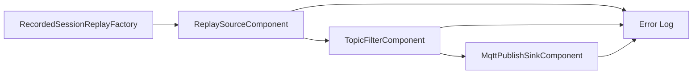

Equivalent code shape:

```csharp
var replay = replayFactory.Create(sessionId);
var filter = TopicFilterComponent.Prefix("factory/");
var publishSink = new MqttPublishSinkComponent(session);

replay.Output.LinkTo(filter.Input, new DataflowLinkOptions { PropagateCompletion = true });
filter.Output.LinkTo(publishSink.Input, new DataflowLinkOptions { PropagateCompletion = true });

replay.Errors.LinkTo(errorSink);
filter.Errors.LinkTo(errorSink);
publishSink.Errors.LinkTo(errorSink);

await replay.StartAsync();
await publishSink.Completion;
```

## Future Component Types

Likely near-term additions:

- dynamic expression mapper
- JSONata mapper
- condition/router component
- storage sink
- metrics sink

Dynamic expression components should use `FlowError.Code` for routing and diagnostics instead of relying on exception message text.
