# Flow Components

Flow components are the building blocks users will eventually place on a Fork Flow canvas.

This page documents the current Dataflow-backed components and shows how each behaves.

## Shared Shape

Current flow nodes expose:

- typed node identity through `FlowNodeId`
- Dataflow lifecycle through `Complete`, `Fault`, and `Completion`
- an `Errors` output port for `FlowError`
- component-specific input and output ports

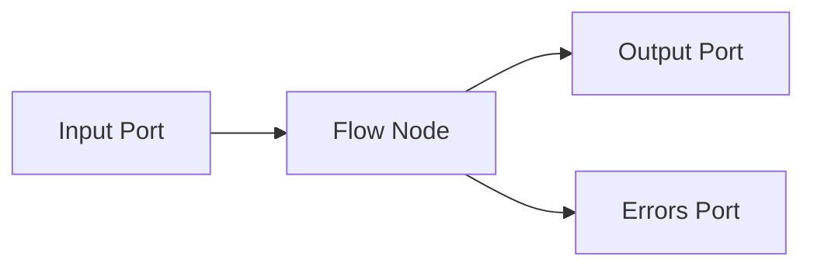

Not every component has an input port. Source and trigger components produce events.

## Connection State Trigger

`ConnectionStateTriggerComponent` converts connection manager state changes into flow events.

### Behavior

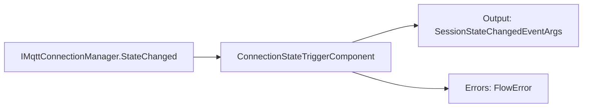

### Usage

```csharp
var trigger = new ConnectionStateTriggerComponent(connectionManager);

trigger.Output.LinkTo(stateSink, new DataflowLinkOptions
{
    PropagateCompletion = true
});
```

### Notes

- Use this when a flow should react to connection lifecycle events.
- Example downstream nodes: state router, notification actor, UI state projection.

## Source Components

Source nodes emit `MqttEnvelope` values through the same `Output` port, but each node type has one clear source responsibility.

Current source node types:

- `mqtt.live-source`: connects to a broker, subscribes, and emits matching traffic.
- `session.source`: streams messages from LiteDB by `SessionId`.
- `generated.source`: emits configured messages for deterministic tests and samples.

### Behavior

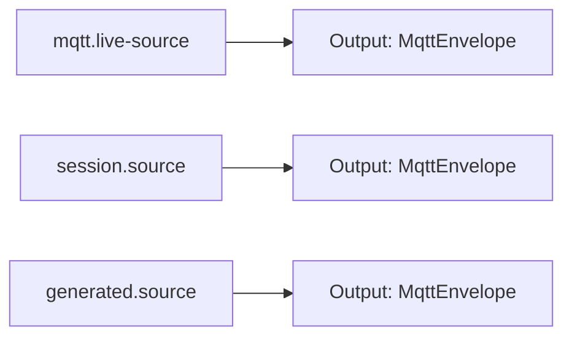

### Flow Definition

Registered workflow node types: `mqtt.live-source`, `session.source`, `generated.source`

Ports:

- `Output`: `MqttEnvelope`
- `Errors`: `FlowError`

Live source:

```json
{
  "traffic": {
    "type": "mqtt.live-source",
    "configuration": {
      "profile": {
        "name": "local-broker",
        "host": "localhost",
        "port": 1883
      },
      "subscriptions": [
        "factory/#"
      ],
      "boundedCapacity": 1000
    }
  },
  "inspect": {
    "type": "mqtt.payload-inspector",
    "Input": "traffic.Output"
  }
}
```

Stored-session source:

```json
{
  "stored": {
    "type": "session.source",
    "configuration": {
      "sessionId": "00000000-0000-0000-0000-000000000001",
      "preserveTiming": false,
      "speed": 1
    }
  }
}
```

The stored-session mode requires the host to provide `IMessageRepository` when registering component factories.

## MQTT Connection and Trigger

`MqttConnectionComponent` owns the MQTT session lifecycle. `MqttTriggerComponent` references that shared connection, installs its own subscriptions, and emits matching `MqttEnvelope` values.

### Behavior

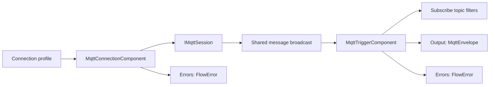

### Usage

```csharp
var connection = new MqttConnectionComponent(session, disposeSessionOnDispose: false);
var trigger = new MqttTriggerComponent(connection,
[
    new MqttSubscription("factory/#", MqttQualityOfServiceLevel.AtMostOnce)
]);

trigger.Output.LinkTo(filter.Input, new DataflowLinkOptions
{
    PropagateCompletion = true
});

connection.Errors.LinkTo(errorSink);
trigger.Errors.LinkTo(errorSink);

await connection.StartAsync();
await trigger.StartAsync();
```

### Flow Definition

Registered resource node type: `mqtt.connection`

Ports:

- `Errors`: `FlowError`

Registered workflow node type: `mqtt.trigger`

Ports:

- `Output`: `MqttEnvelope`
- `Errors`: `FlowError`

```json
{
  "resources": {
    "broker": {
      "type": "mqtt.connection",
      "configuration": {
        "profile": {
          "name": "local-broker",
          "host": "localhost",
          "port": 1883
        }
      }
    }
  },
  "workflows": {
    "observeTraffic": {
      "trigger": {
        "type": "mqtt.trigger",
        "configuration": {
          "connection": "broker",
          "subscriptions": [
            "factory/#",
            { "topicFilter": "telemetry/#", "qos": "AtLeastOnce" }
          ],
          "boundedCapacity": 1000
        }
      }
    }
  }
}
```

The connection binding is configuration, not a dataflow link. This keeps the connection reusable across workflows while each trigger owns the topic filters that define when it emits messages.

### Failure Behavior

If the session reader fails, the connection publishes a `FlowError` and completes its broadcast. If subscription startup fails, the trigger publishes a `FlowError`; the application host turns startup failures into structured host errors instead of letting them escape the process boundary.

## Message Filter

`MessageFilterComponent` forwards only matching MQTT messages.

### Behavior

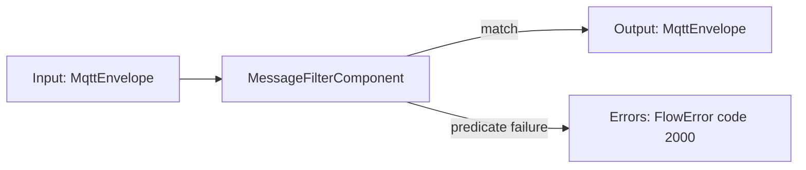

### Usage

```csharp
var filter = MessageFilterComponent.Prefix("factory/");

source.LinkTo(filter.Input, new DataflowLinkOptions
{
    PropagateCompletion = true
});

filter.Output.LinkTo(next.Input, new DataflowLinkOptions
{
    PropagateCompletion = true
});
```

### Failure Behavior

If the predicate throws, the component publishes a `FlowError` and drops that message. Later messages continue processing.

## MQTT Condition Router

`MqttConditionRouterComponent` routes each MQTT message to one of two output ports.

Use it when non-matching messages should continue through a separate branch instead of being dropped.

### Behavior

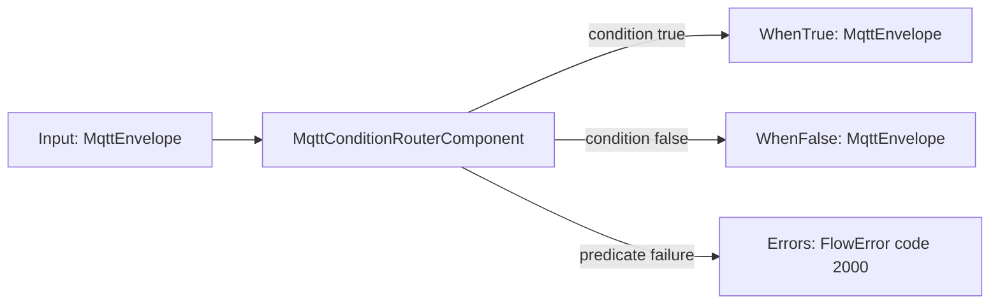

### Usage

```csharp
var router = MqttConditionRouterComponent.TopicPrefix("factory/");

source.Output.LinkTo(router.Input, new DataflowLinkOptions
{
    PropagateCompletion = true
});

router.WhenTrue.LinkTo(factorySink, new DataflowLinkOptions { PropagateCompletion = true });
router.WhenFalse.LinkTo(otherSink, new DataflowLinkOptions { PropagateCompletion = true });
router.Errors.LinkTo(errorSink);
```

### Failure Behavior

If the predicate throws, the component publishes a `FlowError` and drops that message. Later messages continue routing.

## Payload Inspector Mapper

`PayloadInspectorMapperComponent` maps raw MQTT messages into inspected payload messages.

### Behavior

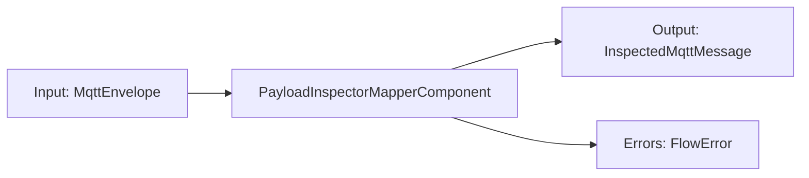

### Usage

```csharp
var mapper = new PayloadInspectorMapperComponent();

filter.Output.LinkTo(mapper.Input, new DataflowLinkOptions
{
    PropagateCompletion = true
});

mapper.Output.LinkTo(uiSink, new DataflowLinkOptions
{
    PropagateCompletion = true
});
```

### Flow Definition

Registered node type: `mqtt.payload-inspector`

Ports:

- `Input`: `MqttEnvelope`
- `Output`: `InspectedMqttMessage`
- `Errors`: `FlowError`

```json
{
  "inspect": {
    "type": "mqtt.payload-inspector",
    "Input": "source.Output"
  }
}
```

### Output

`InspectedMqttMessage` contains:

- original `MqttEnvelope`
- payload inspection result

## Replay Source

`ReplaySourceComponent` emits recorded MQTT messages in timestamp order.

### Behavior

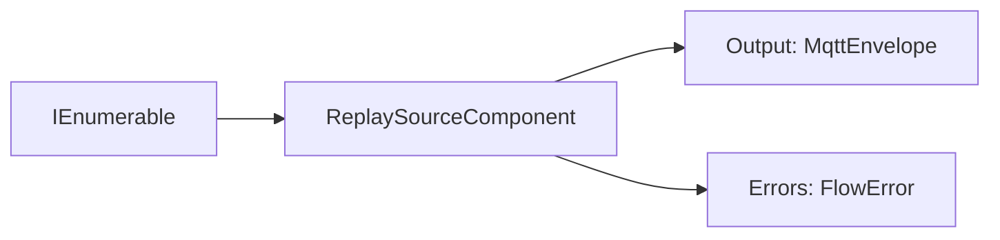

### Timing

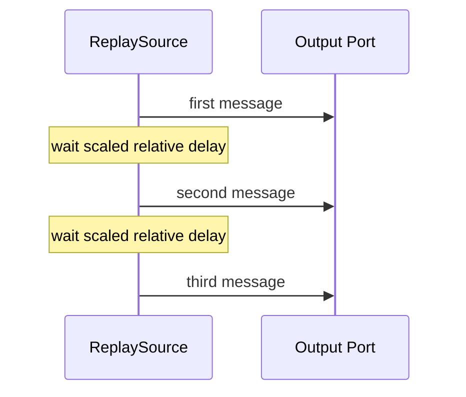

### Usage

```csharp
var replay = new ReplaySourceComponent(messages, speed: 2);

replay.Output.LinkTo(next.Input, new DataflowLinkOptions
{
    PropagateCompletion = true
});

await replay.StartAsync();
```

### Notes

- `speed = 1` preserves original relative timing.
- `speed = 2` replays twice as fast.
- delay behavior is injectable for deterministic tests.

## MQTT Publish Request Mapper

`MqttPublishRequestMapperComponent` maps incoming MQTT envelopes into explicit publish commands. The mapper can preserve the input envelope or use configured expressions to produce a different topic, payload, QoS, and retain flag.

### Behavior

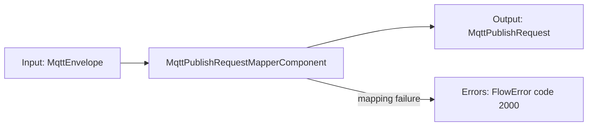

### Usage

```csharp
var mapper = new MqttPublishRequestMapperComponent(MqttPublishRequestMapperComponent.PreserveEnvelope);

source.LinkTo(mapper.Input, new DataflowLinkOptions
{
    PropagateCompletion = true
});

mapper.Errors.LinkTo(errorSink);
```

### Failure Behavior

If mapping fails for one message, the mapper publishes a `FlowError` with the topic in `Context` and continues processing later messages.

## MQTT Publisher

`MqttPublisherComponent` consumes `MqttPublishRequest` commands and publishes them through an active MQTT session.

### Behavior

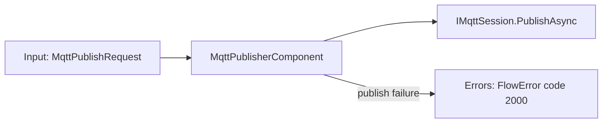

### Usage

```csharp
var publisher = new MqttPublisherComponent(session);

mapper.Output.LinkTo(publisher.Input, new DataflowLinkOptions
{
    PropagateCompletion = true
});

publisher.Errors.LinkTo(errorSink);
```

### Failure Behavior

If publishing fails for one request, the publisher publishes a `FlowError` with the topic in `Context` and continues processing later requests.

The component preserves publish order by default. Higher parallelism is available through the constructor, but ordered single-message publishing should remain the default for replay and deterministic flow behavior.

## MQTT Recording Request Mapper

`MqttRecordingRequestMapperComponent` maps incoming MQTT envelopes into recording commands that carry the target session id.

### Behavior


## MQTT Recorder

`MqttRecorderComponent` stores incoming `MqttRecordingRequest` commands for a recording session.

This component lives in `FluxMq.Components` because it bridges flow nodes with storage repositories. `FluxMq.Pipeline` stays independent from storage and concrete component dependencies.

### Behavior

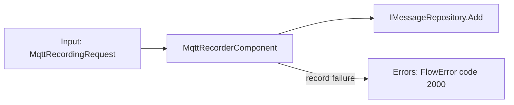

### Usage

```csharp
var recorder = new MqttRecorderComponent(messageRepository);

recordingMapper.Output.LinkTo(recorder.Input, new DataflowLinkOptions
{
    PropagateCompletion = true
});

recorder.Errors.LinkTo(errorSink);
```

### Failure Behavior

If a message cannot be stored, the recorder publishes a `FlowError` with the topic in `Context` and continues recording later messages.

## MQTT Metrics

`MqttMetricsComponent` observes incoming MQTT messages and broadcasts immutable metric snapshots. It works only from its input stream; it does not care whether the data came from a live connection, replay, stored session, generated source, or imported source.

These snapshots are local flow data. Planned OpenTelemetry support should export selected observability signals later without making this component depend on external collectors.

### Behavior

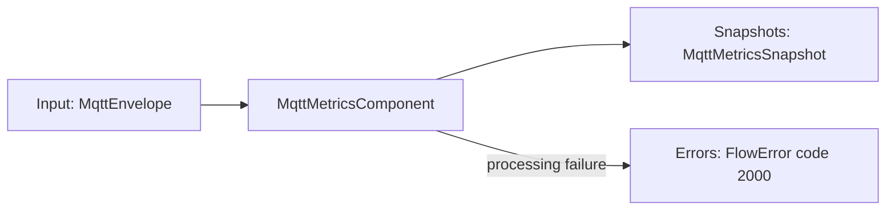

### Usage

```csharp
var metrics = new MqttMetricsComponent();

source.Output.LinkTo(metrics.Input, new DataflowLinkOptions
{
    PropagateCompletion = true
});

metrics.Snapshots.LinkTo(metricsUiSink);
metrics.Errors.LinkTo(errorSink);
```

### Flow Definition

Registered node type: `mqtt.metrics`

Ports:

- `Input`: `MqttEnvelope`
- `Snapshots`: `MqttMetricsSnapshot`
- `Errors`: `FlowError`

```json
{
  "metrics": {
    "type": "mqtt.metrics",
    "Input": "source.Output"
  }
}
```

### Snapshot

`MqttMetricsSnapshot` contains:

- message count
- total payload bytes
- minimum payload bytes
- maximum payload bytes
- retained message count
- unique topic count
- last topic
- last received timestamp
- average payload bytes

## Recorded Session Replay Factory

`RecordedSessionReplayFactory` creates replay sources from stored sessions.

This is not a flow node. It is an orchestration service.

### Behavior

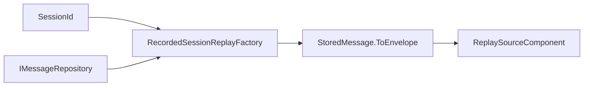

### Usage

```csharp
var factory = new RecordedSessionReplayFactory(messageRepository);
var replay = factory.Create(sessionId, new RecordedSessionReplayOptions
{
    Speed = 2
});
```

## Sample Flow

This flow reads traffic through a source, filters it, inspects payloads, and projects results to UI. The same downstream graph can run from live or stored traffic by choosing the appropriate source node.

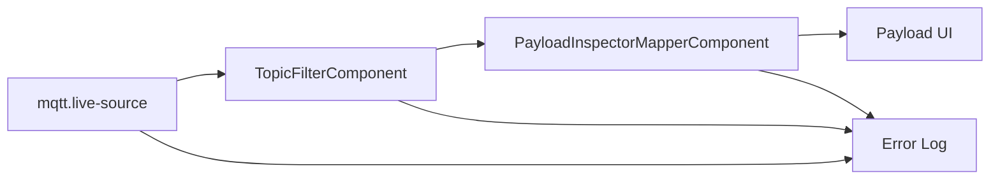

Equivalent code shape:

```csharp
var source = new LiveMqttSourceComponent(session,
[
    new MqttSubscription("factory/#", MqttQualityOfServiceLevel.AtMostOnce)
]);
var filter = TopicFilterComponent.Prefix("factory/");
var mapper = new PayloadInspectorMapperComponent();

source.Output.LinkTo(filter.Input, new DataflowLinkOptions { PropagateCompletion = true });
filter.Output.LinkTo(mapper.Input, new DataflowLinkOptions { PropagateCompletion = true });
mapper.Output.LinkTo(payloadUiSink, new DataflowLinkOptions { PropagateCompletion = true });

source.Errors.LinkTo(errorSink);
filter.Errors.LinkTo(errorSink);
mapper.Errors.LinkTo(errorSink);

await source.StartAsync();
```

This flow branches live traffic into two paths.

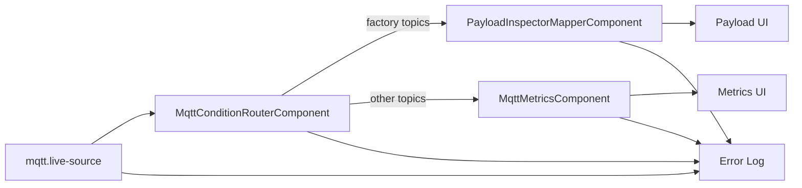

This flow records selected live traffic.

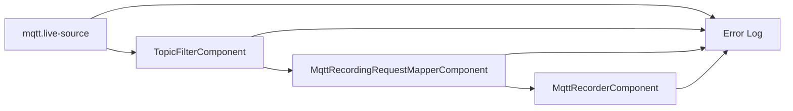

This flow replays a recorded session back through an MQTT session.

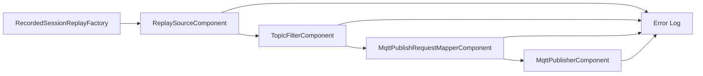

Equivalent code shape:

```csharp
var replay = replayFactory.Create(sessionId);
var filter = TopicFilterComponent.Prefix("factory/");
var publishMapper = new MqttPublishRequestMapperComponent(MqttPublishRequestMapperComponent.PreserveEnvelope);
var publisher = new MqttPublisherComponent(session);

replay.Output.LinkTo(filter.Input, new DataflowLinkOptions { PropagateCompletion = true });
filter.Output.LinkTo(publishMapper.Input, new DataflowLinkOptions { PropagateCompletion = true });
publishMapper.Output.LinkTo(publisher.Input, new DataflowLinkOptions { PropagateCompletion = true });

replay.Errors.LinkTo(errorSink);
filter.Errors.LinkTo(errorSink);
publishMapper.Errors.LinkTo(errorSink);
publisher.Errors.LinkTo(errorSink);

await replay.StartAsync();
await publisher.Completion;
```

## Future Component Types

Likely near-term additions:

- dynamic expression mapper
- JSONata mapper

Dynamic expression components should use `FlowError.Code` for routing and diagnostics instead of relying on exception message text.

OpenTelemetry support is planned as an observability export layer, not as a replacement for local flow components.
