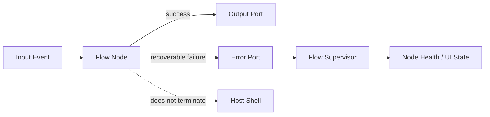

# Flow Errors

Flow component failures must not terminate the application.

Recoverable failures should become data and travel through the flow error port.

## FlowError

Current shape:

```csharp
public sealed record FlowError
{
    public required FlowNodeId NodeId { get; init; }
    public required int Code { get; init; }
    public required string Message { get; init; }
    public Exception? Exception { get; init; }
    public DateTimeOffset OccurredAt { get; init; }
    public string? Context { get; init; }
}
```

## Error Codes

Error codes are plain integers because they are public protocol data.

Current reserved values:

```csharp
public static class FlowErrorCodes
{
    public const int NodeFaulted = 1000;
    public const int ProcessingFailed = 2000;
    public const int DynamicExpressionFailed = 3000;
}
```

## Why Plain Integers

Dynamic expressions and routing rules should compare codes directly:

```jsonata
code = 3000
```

or:

```jsonata
code >= 3000 and code < 4000
```

This is simpler and more stable than depending on exception types or message text.

## Failure Handling Rule

Expected behavior:

- recoverable processing failure: publish `FlowError`, continue when possible
- explicit node fault: publish `FlowError`, fault that node
- host shell: remains alive
- future supervisor: observes node state and error events



## Example JSON Shape

```json
{
  "nodeId": "1890f53d-30e5-4f57-a5de-f2acbb390647",
  "code": 3000,
  "message": "Dynamic expression failed.",
  "context": "payload.temperature",
  "occurredAt": "2026-05-08T14:00:00Z"
}
```
