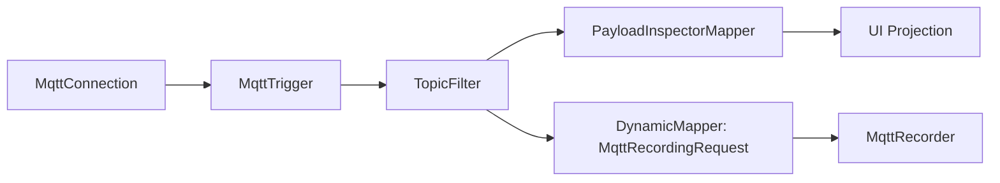
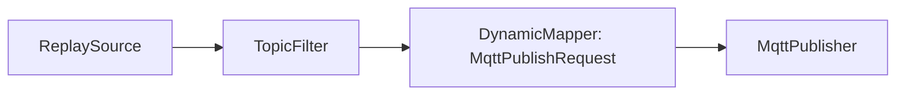
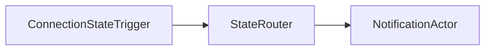
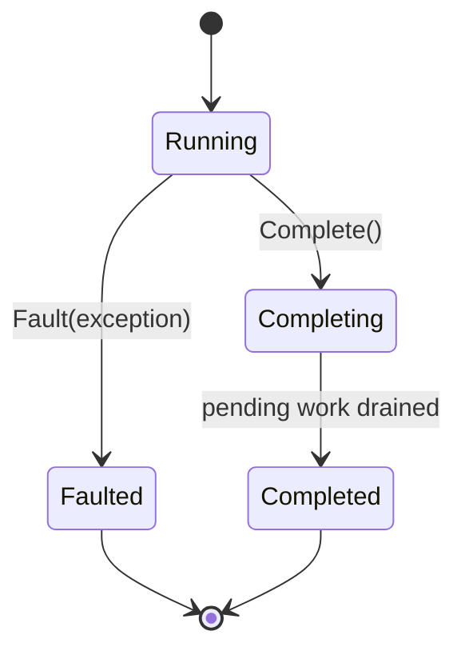
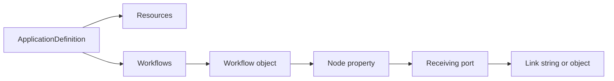

# Fork Flow

Fork Flow is the planned user-configurable flow system for FluxMQ.

The goal is to let users define message and event flows through configuration first, and later through a drag-and-drop editor.

## Concept

```text
source / trigger
  -> mapper / filter / router
  -> actor / observer / projection / replay / publish
```

Examples:







## Current Concrete Components

See [Flow Components](flow-components.md) for behavior diagrams and sample usage.

### ConnectionStateTriggerComponent

Broadcasts MQTT connection state changes as flow events.

### MqttConnectionComponent

Owns the MQTT client lifecycle as a shared resource.

### MqttTriggerComponent

References a shared MQTT connection, subscribes to topic filters, and broadcasts matching `MqttEnvelope` values.

### TopicFilterComponent

Filters `MqttEnvelope` messages using a predicate.

### MqttConditionRouterComponent

Routes `MqttEnvelope` messages to `WhenTrue` or `WhenFalse` output ports.

### PayloadInspectorMapperComponent

Maps `MqttEnvelope` into `InspectedMqttMessage`.

### ReplaySourceComponent

Replays ordered `MqttEnvelope` values with relative timing and speed control.

### Dynamic Mapper

The user-facing `flow.mapper` node maps `MqttEnvelope` values into the explicit request type required by the next actor. Examples include `MqttPublishRequest`, `MqttRecordingRequest`, and `FileWriteRequest`.

Request-specific mapper component classes may exist as runtime implementation details and compatibility aliases, but they are not separate product components in the visual catalog.

### MqttPublisherComponent

Publishes `MqttPublishRequest` values through an MQTT client and reports publish failures through the error port.

### MqttRecorderComponent

Stores `MqttRecordingRequest` values through `IMessageRepository` for a recording session.

### MqttMetricsComponent

Tracks message counters and broadcasts `MqttMetricsSnapshot` values for observability views.

## Flow Node Lifecycle

Flow nodes expose TPL Dataflow lifecycle behavior:

- `Complete()`
- `Fault(Exception)`
- `Completion`

This matters because Fork Flow needs consistent shutdown and fault propagation behavior across the graph.



## Typed Internal Identity

Flow nodes use `FlowNodeId`.

Typed IDs are used for internal domain identity where mixing values would be dangerous.

## Public Protocol Data

Values intended for dynamic expressions, UI filtering, logs, and configuration should remain easy to consume.

Example:

- `FlowError.NodeId` is a typed internal identity.
- `FlowError.Code` is a plain integer because it is public protocol data.

## Flow Application Definition Model

Fork Flow now has an initial config-first application definition model. The top-level definition represents one runnable FluxMQ application package: shared resources plus one or more named workflows.

Current definition types:

- `ApplicationDefinition`
- `NodeDefinition`
- `NodeType`
- `PortName`
- `PortReference`
- `LinkDefinition`

Definitions are object-shaped for hand-authored configuration:



Example JSON shape:

```json
{
  "resources": {
    "broker": {
      "type": "mqtt.connection",
      "configuration": {
        "profile": {
          "name": "local-broker",
          "host": "localhost",
          "port": 1883
        }
      }
    }
  },
  "workflows": {
    "observeTraffic": {
      "trigger": {
        "type": "mqtt.trigger",
        "configuration": {
          "connection": "broker",
          "subscriptions": [
            "factory/#",
            { "topicFilter": "telemetry/#", "qos": 1 }
          ]
        }
      },
      "metrics": {
        "type": "mqtt.metrics",
        "Input": "trigger.Output"
      }
    }
  }
}
```

The node name is the property name inside the workflow object. Links are declared on the receiving port.

Shared resources live beside workflows so several workflows can reference the same connection, database, or other long-lived service definition.

Single link shorthand:

```json
{
  "Input": "source.Output"
}
```

Multiple links:

```json
{
  "Input": ["source.Output", "replay.Output"]
}
```

Conditional link object:

```json
{
  "Input": {
    "from": "source.Output",
    "when": "input.Topic.StartsWith(\"factory/\")"
  }
}
```

Default condition for all links on a component:

```json
{
  "type": "mqtt.message-filter",
  "When": "payload.size > 0",
  "Input": [
    "source.Output",
    {
      "from": "replay.Output",
      "when": "input.Topic.StartsWith(\"factory/\")"
    }
  ]
}
```

If a link has its own `when`, it wins. Otherwise the component-level `when` applies.

`ApplicationDefinitionValidator` currently checks:

- at least one workflow exists
- workflow names are not empty
- workflows are not empty
- node and resource names are not empty
- node types are not empty
- links use valid `node.port` references
- link source nodes exist in the current workflow or shared resources
- target and source ports are not empty
- duplicate links are rejected

Runtime graph construction is package-owned and intentionally separate from FluxMQ-specific dashboards, tests, and UI state.

## Application Runtime Direction

The runtime boundary is the host-independent `FluxFlow.Engine` package. A desktop app, console runner, Windows service, or tool host should all be able to load the same executable resources and workflows.

The first application host boundary is `FluxMq.App`. It is a class library, not a UI project. `FlowApplicationHost` currently:

- reads `FluxMq:FlowApplication` through the .NET configuration system
- converts the configuration tree into `FluxMqApplicationDefinition`
- projects executable resources and workflows into the engine definition
- builds a runtime with `ApplicationRuntimeBuilder`
- exposes build results and host state
- starts and stops the current runtime

Example appsettings shape:

```json
{
  "FluxMq": {
    "FlowApplication": {
      "workflows": {
        "observe": {
          "metrics": {
            "type": "mqtt.metrics"
          }
        }
      }
    }
  }
}
```

The JSON file is only one provider. The host boundary should continue to accept normal .NET configuration so CLI arguments, environment values, persisted settings, and UI-generated definitions can converge on the same runtime path.

The first CLI alpha command validates a configured flow application:

```powershell
dotnet run --project src/FluxMq.Cli -- validate --config samples/flow-applications/metrics-only.json
```

The generated traffic sample exercises `generated.source` without requiring a broker:

```powershell
dotnet run --project src/FluxMq.Cli -- validate --config samples/flow-applications/generated-traffic-inspect.json
```

For automation, the same validation command can emit structured output:

```powershell
dotnet run --project src/FluxMq.Cli -- validate --config samples/flow-applications/metrics-only.json --output json
```

The first `run` command exercises the same host lifecycle and stops after a bounded duration:

```powershell
dotnet run --project src/FluxMq.Cli -- run --config samples/flow-applications/metrics-only.json --duration-ms 1000
```

The first runtime builder slice is intentionally small. `ApplicationRuntimeBuilder`:

- validates an `ApplicationDefinition`
- creates runtime nodes through registered factories
- passes factory context so registrations know whether they are building a shared resource or a workflow node
- starts nodes by `NodeDefinition.Phase`, with lower phases first across resources and workflow nodes
- links workflow ports through typed input/output port adapters
- evaluates per-link `when` expressions before delivering each output item
- supports shared resources as link sources
- returns build errors for validation, missing factories, missing ports, type mismatches, and link failures
- completes only entry nodes so Dataflow completion propagates through linked graphs in order
- disposes workflow nodes before shared resources

The preferred alpha source registrations use the shared connection/trigger pair for live broker traffic, plus explicit source nodes for stored, replayed, and configured message streams:
- `session.source`
  - Workflow source node for stored session messages.
  - `Output`: `MqttEnvelope`
  - `Errors`: `FlowError`
- `generated.source`
  - Workflow source node for deterministic sample/test messages.
  - `Output`: `MqttEnvelope`
  - `Errors`: `FlowError`
- `mqtt.connection`
  - Shared resource node.
  - Owns the `IMqttBrokerClient` lifecycle and broadcasts received envelopes internally to triggers.
  - `Errors`: `FlowError`
- `mqtt.trigger`
  - Workflow trigger node.
  - References a `mqtt.connection` resource, installs subscriptions, and emits matching messages.
  - `Output`: `MqttEnvelope`
  - `Errors`: `FlowError`
- `mqtt.payload-inspector`
  - `Input`: `MqttEnvelope`
  - `Output`: `InspectedMqttMessage`
  - `Errors`: `FlowError`
- `flow.mapper`
  - User-facing dynamic mapper node.
  - `Input`: currently `MqttEnvelope`
  - `Output`: configured request type, such as `MqttPublishRequest`, `MqttRecordingRequest`, or `FileWriteRequest`
  - `Errors`: `FlowError`
- `mqtt.metrics`
  - `Input`: `MqttEnvelope`
  - `Snapshots`: `MqttMetricsSnapshot`
  - `Errors`: `FlowError`

Register them with `RegisterPipelineComponentFactories()` on `RuntimeNodeFactoryRegistry`.

Factories that need lifecycle context can use the context-aware registration shape:

```csharp
registry.Register(new NodeType("example.resource"), context =>
{
    if (!context.IsResource)
    {
        throw new InvalidOperationException("This node type must be declared as a shared resource.");
    }

    return CreateRuntimeNode(context.Name, context.Definition);
});
```

Producer or service-backed nodes that need explicit start work should override `IFlowNode.StartAsync`. Startup failures are converted into host build errors instead of escaping through the CLI or host shell.

Preferred alpha configuration shape with `mqtt.connection` plus `mqtt.trigger`:

```json
{
  "resources": {
    "broker": {
      "type": "mqtt.connection",
      "configuration": {
        "profile": {
          "name": "local-broker",
          "host": "localhost",
          "port": 1883,
          "keepAliveSeconds": 30,
          "cleanStart": true
        }
      }
    }
  },
  "workflows": {
    "observeTraffic": {
      "trigger": {
        "type": "mqtt.trigger",
        "configuration": {
          "connection": "broker",
          "subscriptions": [
            "factory/#",
            { "topicFilter": "telemetry/#", "qos": "AtLeastOnce" }
          ],
          "boundedCapacity": 1000
        }
      },
      "metrics": {
        "type": "mqtt.metrics",
        "Input": "trigger.Output"
      }
    }
  }
}
```

Stored-session source configuration:

```json
{
  "stored": {
    "type": "session.source",
    "configuration": {
      "sessionId": "00000000-0000-0000-0000-000000000001",
      "preserveTiming": false,
      "speed": 1
    }
  }
}
```

`mqtt.trigger.configuration.subscriptions` supports:

- string shorthand (`"factory/#"`)
- array of strings
- array of objects (`topicFilter` + optional `qos`)

`qos` supports `0|1|2` or `AtMostOnce|AtLeastOnce|ExactlyOnce`.

Other registered components currently accept optional configuration:

```json
{
  "configuration": {
    "boundedCapacity": 1000
  }
}
```

Predicate-driven components such as topic filters and condition routers are not registered yet because their expression/configuration model needs deliberate design first.

## Source-Agnostic Execution

Fork Flow should not split downstream behavior between live and offline sources.

A workflow links to a logical traffic source. The host then binds that source to one concrete mode:

- live MQTT broker
- stored session
- timed replay
- offline replay as fast as possible
- imported or generated data later

Topic tree, recent messages, payload inspection, metrics, and dashboards should consume runtime/projection outputs from the active source binding. The dashboard should not implement separate live and replay behavior.

Stored sessions now have a streaming execution path through `IMessageRepository.ReadEnvelopesBySessionAsync`. Stored messages include a per-session sequence value so equal timestamps still replay deterministically.

The wider runtime controller should later own:

- application definition loading
- shared resource lifetime beyond a single cold build
- workflow start, stop, and completion supervision
- reload coordination
- graph patch operations
- component error routing and supervision

Hot reload should belong to this runtime layer, not to the UI shell. The UI can request a reload, but the runtime decides how to validate the next definition, preserve unaffected resources, patch links, and report failures.

## Contracts

The current code intentionally avoids a large contract system.

The rule is:

Build concrete components first. Add small definition and validation primitives next. Extract formal descriptors, config schemas, and factories only after repeated patterns are clear.
