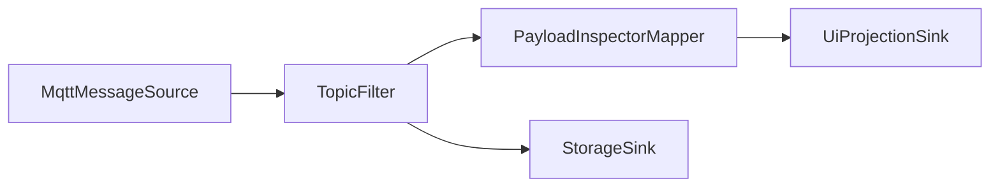
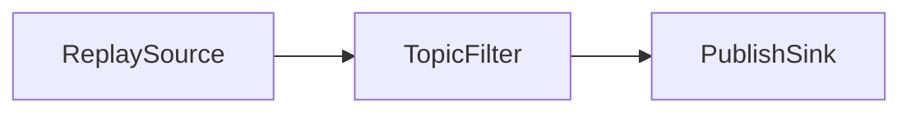
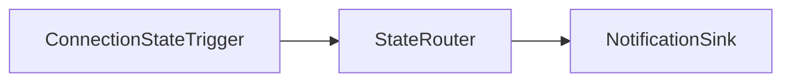
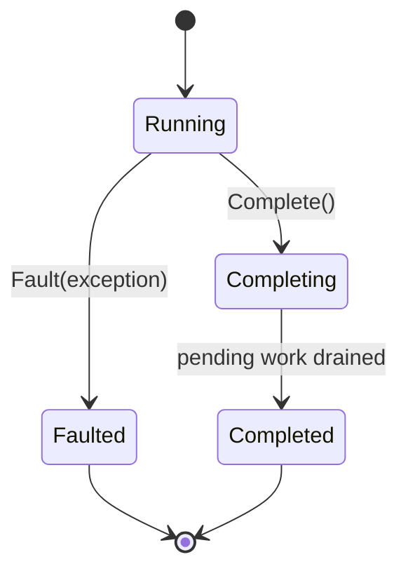
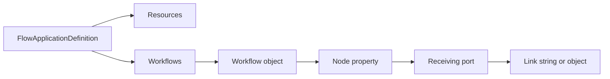

# Fork Flow

Fork Flow is the planned user-configurable flow system for FluxMQ.

The goal is to let users define message and event flows through configuration first, and later through a drag-and-drop editor.

## Concept

```text
source / trigger
  -> mapper / filter / router
  -> sink / projection / replay / publish
```

Examples:







## Current Concrete Components

See [Flow Components](flow-components.md) for behavior diagrams and sample usage.

### ConnectionStateTriggerComponent

Broadcasts MQTT connection state changes as flow events.

### MqttMessageSourceComponent

Reads live MQTT messages from a session and broadcasts them as `MqttEnvelope` values.

### TopicFilterComponent

Filters `MqttEnvelope` messages using a predicate.

### MqttConditionRouterComponent

Routes `MqttEnvelope` messages to `WhenTrue` or `WhenFalse` output ports.

### PayloadInspectorMapperComponent

Maps `MqttEnvelope` into `InspectedMqttMessage`.

### ReplaySourceComponent

Replays ordered `MqttEnvelope` values with relative timing and speed control.

### MqttPublishSinkComponent

Publishes `MqttEnvelope` values through an MQTT session and reports publish failures through the error port.

### MqttRecordingSinkComponent

Stores `MqttEnvelope` values through `IMessageRepository` for a recording session.

### MqttMetricsSinkComponent

Tracks message counters and broadcasts `MqttMetricsSnapshot` values for observability views.

## Flow Node Lifecycle

Flow nodes expose TPL Dataflow lifecycle behavior:

- `Complete()`
- `Fault(Exception)`
- `Completion`

This matters because Fork Flow needs consistent shutdown and fault propagation behavior across the graph.



## Typed Internal Identity

Flow nodes use `FlowNodeId`.

Typed IDs are used for internal domain identity where mixing values would be dangerous.

## Public Protocol Data

Values intended for dynamic expressions, UI filtering, logs, and configuration should remain easy to consume.

Example:

- `FlowError.NodeId` is a typed internal identity.
- `FlowError.Code` is a plain integer because it is public protocol data.

## Flow Application Definition Model

Fork Flow now has an initial config-first application definition model. The top-level definition represents one runnable FluxMQ application package: shared resources plus one or more named workflows.

Current definition types:

- `FlowApplicationDefinition`
- `FlowNodeDefinition`
- `FlowNodeType`
- `FlowPortName`
- `FlowPortReference`
- `FlowLinkDefinition`

Definitions are object-shaped for hand-authored configuration:



Example JSON shape:

```json
{
  "resources": {
    "broker": {
      "type": "mqtt.connection"
    }
  },
  "workflows": {
    "observeTraffic": {
      "source": {
        "type": "mqtt.message-source",
        "Connection": "broker.Output"
      },
      "metrics": {
        "type": "mqtt.metrics-sink",
        "Input": "source.Output"
      }
    }
  }
}
```

The node name is the property name inside the workflow object. Links are declared on the receiving port.

Shared resources live beside workflows so several workflows can reference the same connection, database, or other long-lived service definition.

Single link shorthand:

```json
{
  "Input": "source.Output"
}
```

Multiple links:

```json
{
  "Input": ["source.Output", "replay.Output"]
}
```

Conditional link object:

```json
{
  "Input": {
    "From": "source.Output",
    "When": "topic.startsWith('factory/')"
  }
}
```

Default condition for all links on a component:

```json
{
  "type": "mqtt.recording-sink",
  "When": "payload.size > 0",
  "Input": [
    "source.Output",
    {
      "From": "replay.Output",
      "When": "topic.startsWith('factory/')"
    }
  ]
}
```

If a link has its own `When`, it wins. Otherwise the component-level `When` applies.

`FlowApplicationDefinitionValidator` currently checks:

- at least one workflow exists
- workflow names are not empty
- workflows are not empty
- node and resource names are not empty
- node types are not empty
- links use valid `node.port` references
- link source nodes exist in the current workflow or shared resources
- target and source ports are not empty
- duplicate links are rejected

Runtime graph construction is intentionally separate and will come after this definition shape is exercised.

## Application Runtime Direction

The runtime boundary is a host-independent class library direction. A desktop app, console runner, Windows service, or tool host should all be able to load the same `FlowApplicationDefinition`.

The first application host boundary is `FluxMq.App`. It is a class library, not a UI project. `FlowApplicationHost` currently:

- reads `FluxMq:FlowApplication` through the .NET configuration system
- converts the configuration tree into `FlowApplicationDefinition`
- builds a runtime with `FlowApplicationRuntimeBuilder`
- exposes build results and host state
- starts and stops the current runtime

Example appsettings shape:

```json
{
  "FluxMq": {
    "FlowApplication": {
      "workflows": {
        "observe": {
          "metrics": {
            "type": "mqtt.metrics-sink"
          }
        }
      }
    }
  }
}
```

The JSON file is only one provider. The host boundary should continue to accept normal .NET configuration so CLI arguments, environment values, persisted settings, and UI-generated definitions can converge on the same runtime path.

The first CLI alpha command validates a configured flow application:

```powershell
dotnet run --project src/FluxMq.Cli -- validate --config samples/flow-applications/metrics-only.json
```

For automation, the same validation command can emit structured output:

```powershell
dotnet run --project src/FluxMq.Cli -- validate --config samples/flow-applications/metrics-only.json --output json
```

The first `run` command exercises the same host lifecycle and stops after a bounded duration:

```powershell
dotnet run --project src/FluxMq.Cli -- run --config samples/flow-applications/metrics-only.json --duration-ms 1000
```

The first runtime builder slice is intentionally small. `FlowApplicationRuntimeBuilder`:

- validates a `FlowApplicationDefinition`
- creates runtime nodes through registered factories
- passes factory context so registrations know whether they are building a shared resource or a workflow node
- starts `IFlowStartable` resources before workflow nodes
- links workflow ports through typed input/output port adapters
- supports shared resources as link sources
- returns build errors for validation, missing factories, missing ports, type mismatches, and link failures
- completes only entry nodes so Dataflow completion propagates through linked graphs in order
- disposes workflow nodes before shared resources

The first concrete registrations are intentionally limited to components with stable construction and no external service dependency:

- `mqtt.payload-inspector`
  - `Input`: `MqttEnvelope`
  - `Output`: `InspectedMqttMessage`
  - `Errors`: `FlowError`
- `mqtt.metrics-sink`
  - `Input`: `MqttEnvelope`
  - `Snapshots`: `MqttMetricsSnapshot`
  - `Errors`: `FlowError`

Register them with `RegisterPipelineComponentFactories()` on `FlowRuntimeNodeFactoryRegistry`.

Factories that need lifecycle context can use the context-aware registration shape:

```csharp
registry.Register(new FlowNodeType("example.resource"), context =>
{
    if (!context.IsResource)
    {
        throw new InvalidOperationException("This node type must be declared as a shared resource.");
    }

    return CreateRuntimeNode(context.Name, context.Definition);
});
```

Producer or service-backed nodes that need explicit start work should implement `IFlowStartable`. Startup failures are converted into host build errors instead of escaping through the CLI or host shell.

Both registered components currently accept optional configuration:

```json
{
  "configuration": {
    "boundedCapacity": 1000
  }
}
```

Predicate-driven components such as topic filters and condition routers are not registered yet because their expression/configuration model needs deliberate design first.

The wider runtime controller should later own:

- application definition loading
- shared resource lifetime beyond a single cold build
- workflow start, stop, and completion supervision
- reload coordination
- graph patch operations
- component error routing and supervision

Hot reload should belong to this runtime layer, not to the UI shell. The UI can request a reload, but the runtime decides how to validate the next definition, preserve unaffected resources, patch links, and report failures.

## Contracts

The current code intentionally avoids a large contract system.

The rule is:

Build concrete components first. Add small definition and validation primitives next. Extract formal descriptors, config schemas, and factories only after repeated patterns are clear.
