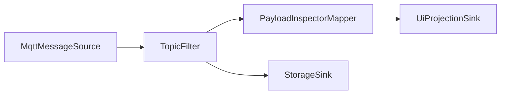
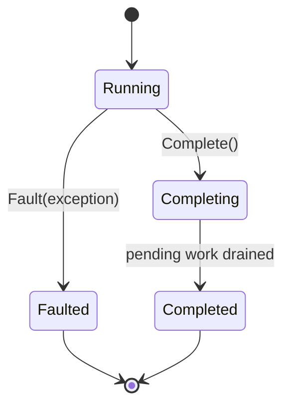

# Fork Flow

Fork Flow is the planned user-configurable flow system for FluxMQ.

The goal is to let users define message and event flows through configuration first, and later through a drag-and-drop editor.

## Concept

```text
source / trigger
  -> mapper / filter / router
  -> sink / projection / replay / publish
```

Examples:




## Current Concrete Components

### ConnectionStateTriggerComponent

Broadcasts MQTT connection state changes as flow events.

### TopicFilterComponent

Filters `MqttEnvelope` messages using a predicate.

### PayloadInspectorMapperComponent

Maps `MqttEnvelope` into `InspectedMqttMessage`.

### ReplaySourceComponent

Replays ordered `MqttEnvelope` values with relative timing and speed control.

## Flow Node Lifecycle

Flow nodes expose TPL Dataflow lifecycle behavior:

- `Complete()`
- `Fault(Exception)`
- `Completion`

This matters because Fork Flow needs consistent shutdown and fault propagation behavior across the graph.



## Typed Internal Identity

Flow nodes use `FlowNodeId`.

Typed IDs are used for internal domain identity where mixing values would be dangerous.

## Public Protocol Data

Values intended for dynamic expressions, UI filtering, logs, and configuration should remain easy to consume.

Example:

- `FlowError.NodeId` is a typed internal identity.
- `FlowError.Code` is a plain integer because it is public protocol data.

## Contracts

The current code intentionally avoids a large contract system.

The rule is:

Build concrete components first. Extract formal descriptors, config schemas, and factories only after repeated patterns are clear.
