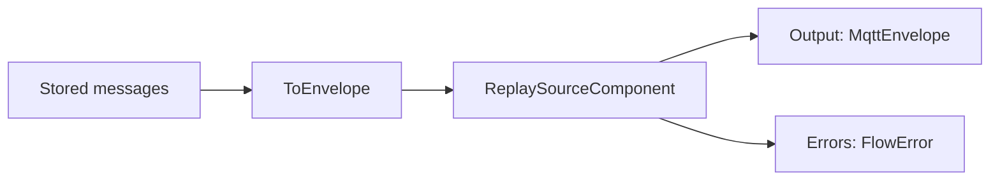
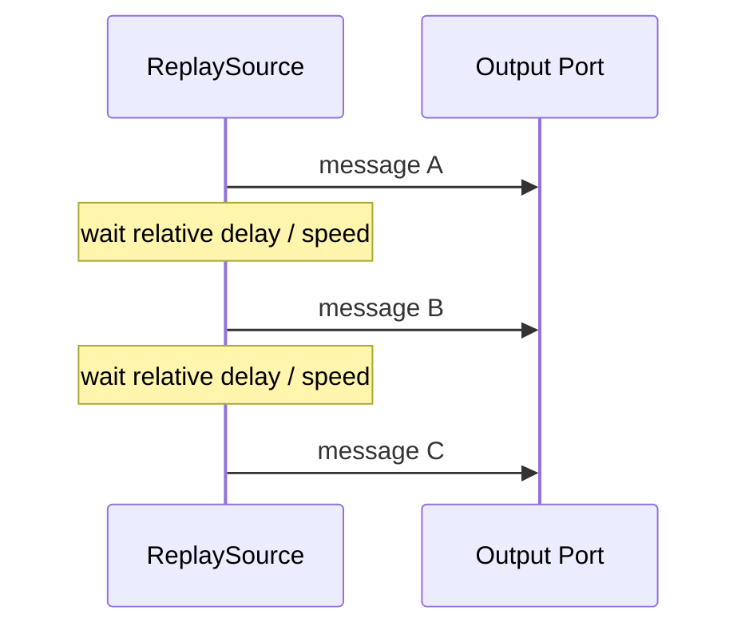
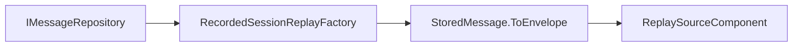
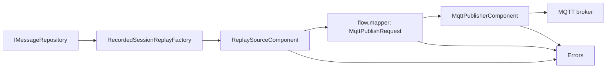

# Replay

Replay is the foundation for time-travel debugging in FluxMQ.

## Current Runtime Component

`ReplaySourceComponent` is a concrete Dataflow-backed source.

It accepts ordered or unordered `MqttEnvelope` values and emits them in `ReceivedAt` order.

## Behavior

- sorts messages by `ReceivedAt`
- preserves relative timing
- supports speed multiplier
- exposes Dataflow lifecycle behavior
- publishes failures through `Errors`
- uses injectable delay behavior for deterministic tests



## Timing

Given messages:

```text
10:00:00 message A
10:00:02 message B
10:00:03 message C
```

At `speed = 1`:

```text
A immediately
wait 2 seconds
B
wait 1 second
C
```

At `speed = 2`:

```text
A immediately
wait 1 second
B
wait 0.5 seconds
C
```



## Storage Integration

The replay source works with `MqttEnvelope`.

Storage integration stays outside the replay source component:

```text
IMessageRepository.ReadEnvelopesBySessionAsync(sessionId)
  -> StoredMessage.ToEnvelope()
  -> ReplaySourceComponent
```

This keeps the package runtime independent from concrete storage dependencies.

`FluxMq.Components` owns this orchestration through `RecordedSessionReplayFactory`.

For source-agnostic workflow execution, stored sessions can also enter the graph directly through `session.source`. Downstream nodes link to that source node's `Output` port.



## Replay To MQTT

Recorded sessions can be replayed back through an MQTT client by mapping each replayed envelope into a `MqttPublishRequest`, then linking the request stream to `MqttPublisherComponent`.



The replay source controls timing. The explicit mapper owns the envelope-to-request transformation. The publisher owns broker publishing and converts publish exceptions into `FlowError` values, so one failed publish does not stop the rest of the replay.

## Next Replay Steps

Likely next components:

- replay UI controls
- speed control UI
- pause/resume support
