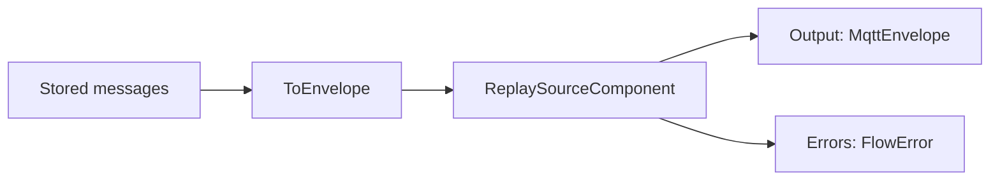
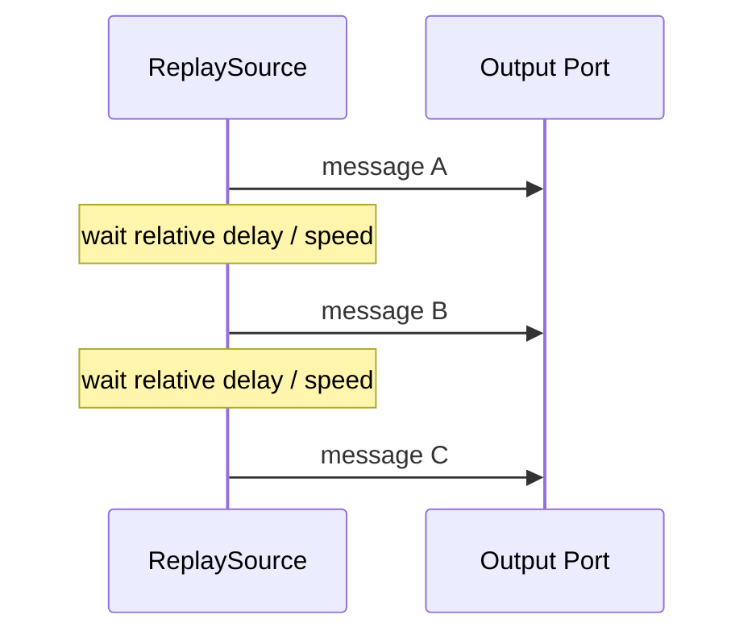

# Replay

Replay is the foundation for time-travel debugging in FluxMQ.

## Current Runtime Component

`ReplaySourceComponent` is a concrete Dataflow-backed source.

It accepts ordered or unordered `MqttEnvelope` values and emits them in `ReceivedAt` order.

## Behavior

- sorts messages by `ReceivedAt`
- preserves relative timing
- supports speed multiplier
- exposes Dataflow lifecycle behavior
- publishes failures through `Errors`
- uses injectable delay behavior for deterministic tests



## Timing

Given messages:

```text
10:00:00 message A
10:00:02 message B
10:00:03 message C
```

At `speed = 1`:

```text
A immediately
wait 2 seconds
B
wait 1 second
C
```

At `speed = 2`:

```text
A immediately
wait 1 second
B
wait 0.5 seconds
C
```



## Storage Integration

The current replay source works with `MqttEnvelope`.

Storage integration should stay outside the source component:

```text
IMessageRepository.GetBySession(sessionId)
  -> StoredMessage.ToEnvelope()
  -> ReplaySourceComponent
```

This keeps `FluxMq.Pipeline` independent from `FluxMq.Storage`.

## Next Replay Steps

Likely next components:

- replay session loader service
- replay publish sink
- replay UI controls
- speed control UI
- pause/resume support
