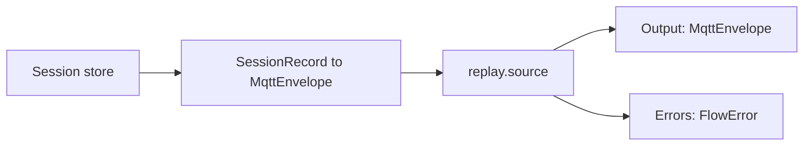
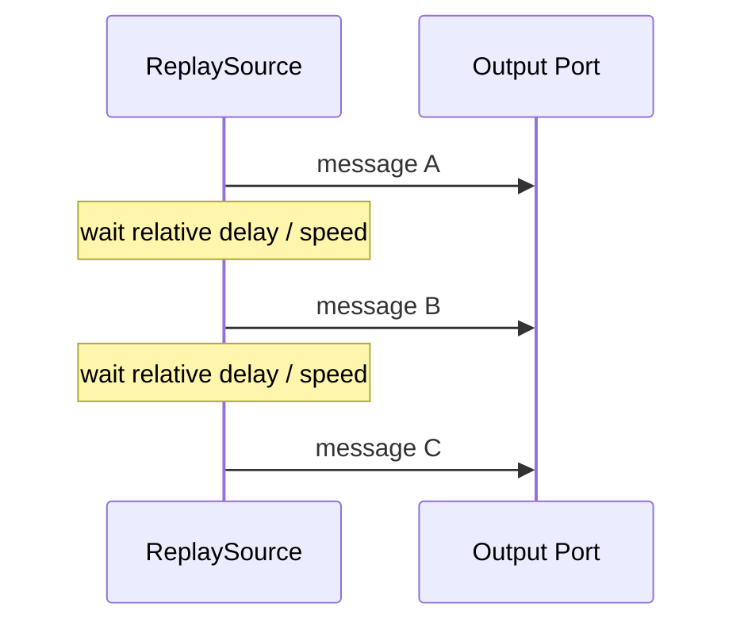
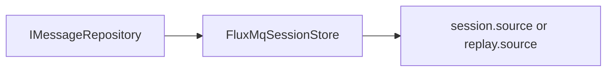
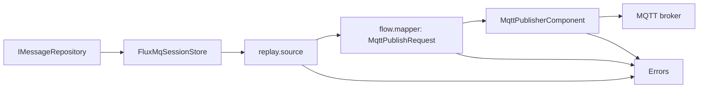

# Replay

Replay is the foundation for time-travel debugging in FluxMQ.

## Current Runtime Component

`replay.source` uses the same session-store-backed runtime path as `session.source`, with timing preservation enabled.

It reads stored session records, converts them to `MqttEnvelope` values, and emits them in stored sequence order.

## Behavior

- streams messages from the session store
- preserves relative timing when replaying
- supports speed multiplier
- exposes Dataflow lifecycle behavior
- publishes failures through `Errors`
- uses injectable delay behavior for deterministic tests



## Timing

Given messages:

```text
10:00:00 message A
10:00:02 message B
10:00:03 message C
```

At `speed = 1`:

```text
A immediately
wait 2 seconds
B
wait 1 second
C
```

At `speed = 2`:

```text
A immediately
wait 1 second
B
wait 0.5 seconds
C
```



## Storage Integration

FluxMQ adapts the shared session contracts to the local message repository:

```text
FluxMqSessionStore.ReadMessagesAsync(sessionId)
  -> SessionRecord
  -> MqttEnvelope
  -> replay.source Output
```

For source-agnostic workflow execution, stored sessions can also enter the graph directly through `session.source`. Downstream nodes link to that source node's `Output` port.



## Replay To MQTT

Recorded sessions can be replayed back through an MQTT client by mapping each replayed envelope into a `MqttPublishRequest`, then linking the request stream to `MqttPublisherComponent`.



The replay source controls timing. The explicit mapper owns the envelope-to-request transformation. The publisher owns broker publishing and converts publish exceptions into `FlowError` values, so one failed publish does not stop the rest of the replay.

## Next Replay Steps

Likely next components:

- replay UI controls
- speed control UI
- pause/resume support
