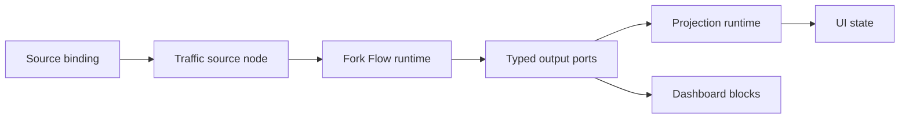

# FluxMQ Architecture Plan

This is the current architecture direction. The original proposal remains useful as the product north star, but this plan is the working build direction.

## Architectural Principle

Build FluxMQ around the message/session flow first. Treat plugins as a future formalization of stable internal module contracts.

## Proposed Solution Structure

```text
/src
  /FluxMq.App
  /FluxMq.Components
  /FluxMq.Core
  /FluxMq.Pipeline
  /FluxMq.UI
  /FluxMq.Modules.PayloadInspector
  /FluxMq.Modules.Observability
  /FluxMq.Modules.Replay
  /FluxMq.Plugins.Abstractions
  /FluxMq.Plugins.Runtime
/memory
```

## Project Responsibilities

### FluxMq.App

Workflow application host boundary.

Initial status:
- Part of the current solution as a class library.
- Loads `ApplicationDefinition` from .NET configuration.
- Builds runtimes through registered factories.
- Controls basic lifecycle with build, start, and stop.
- Holds the future reload coordination boundary.
- Should remain host-independent so desktop, CLI, service, and tool hosts can use the same runtime path.

### FluxMq.Core

Core domain model and MQTT client behavior.

Responsibilities:
- Connection profiles.
- MQTT client lifecycle.
- Topic model.
- Message envelope model.
- Broker capability abstractions.

### FluxMq.Pipeline

Message ingestion, definitions, and runtime primitives.

Responsibilities:
- Channel-based message ingestion.
- Flow application definition model.
- Host-independent flow application runtime.
- Runtime graph building.
- Typed runtime ports.
- Flow lifecycle and flow error primitives.

### FluxMq.Components

Concrete component implementations and local persistence.

Responsibilities:
- MQTT connection and trigger nodes.
- Payload inspection, filtering, routing, publishing, replay, recording, and metrics components.
- Connection profile persistence.
- Session recording.
- Replay session metadata.
- Message storage.
- Lightweight metrics snapshots.
- App settings.
- Keep LiteDB and concrete MQTT component dependencies outside `FluxMq.Pipeline`.

### FluxMq.UI

MAUI Blazor Hybrid desktop workspace.

Responsibilities:
- Compose the alpha desktop app surface with MudBlazor.
- Provide live broker connection, publish, topic, and payload inspection views.
- Provide the visual Fork Flow definition workspace with Blazor.Diagrams.
- Save and load flow application definitions from local files.
- Validate, run, and stop flow application definitions through `FluxMq.App`.
- Keep reusable topic tree and payload inspector components available inside the desktop workspace.

### FluxMq.Modules.PayloadInspector

Internal module for payload decoding and comparison.

Responsibilities:
- JSON/XML/Base64/binary detection.
- Pretty printing.
- Diff support.
- Schema-aware inspection later.

### FluxMq.Modules.Observability

Internal module for metrics and operational dashboards.

Responsibilities:
- Messages per second.
- Payload size statistics.
- Topic activity.
- Silence/spike detection later.
- OpenTelemetry instrumentation and export later.

OpenTelemetry direction:
- Local app metrics remain available without external infrastructure.
- OpenTelemetry exports selected runtime signals to external collectors when configured.
- MQTT topic labels must be designed carefully to avoid high-cardinality telemetry by default.
- Flow node IDs and numeric flow error codes are suitable telemetry dimensions because they are stable runtime identifiers.

### FluxMq.Modules.Replay

Internal module for time travel and replay.

Responsibilities:
- Session timeline.
- Replay with timing control.
- Export/import later.

### FluxMq.Plugins.Abstractions

Future public plugin contracts.

Initial status:
- Keep minimal or postpone until internal module contracts settle.

### FluxMq.Plugins.Runtime

Future dynamic plugin loader.

Initial status:
- Not MVP-critical.
- Add after internal modules prove extension boundaries.

## Core Message Flow

```text
MQTTnet Client
  -> FluxMqttClient
  -> Channel<MqttEnvelope>
  -> Dataflow source adapter
  -> Flow Application Runtime
  -> Storage / Metrics / Topic Index
  -> UI Projection / Host Integration
  -> Optional OpenTelemetry export
```

The same runtime flow must also support stored/offline data:

```text
Stored session / imported file / generated source
  -> Dataflow source adapter
  -> Flow Application Runtime
  -> Storage / Metrics / Topic Index
  -> UI Projection / Dashboard
```

Source mode is an execution binding, not a different workflow model. A workflow should consume a logical source output and remain unchanged when the host binds that source to live broker traffic, a stored session, replay, import, or deterministic test data.

## Flow Application Runtime Direction

Fork Flow should grow a host-independent runtime layer in `FluxMq.Pipeline` or a closely related class library.

Responsibilities:
- Load and validate `ApplicationDefinition`.
- Bind logical source nodes to online or offline data sources.
- Own shared resource lifetime.
- Start, stop, and observe named workflows.
- Coordinate reloads by validating the next definition before applying changes.
- Patch unaffected graph parts in place where possible.
- Convert component failures into flow errors instead of allowing them to escape the runtime boundary.

Current first slice:
- `ApplicationRuntimeBuilder` performs cold-start graph construction.
- Runtime node factories create concrete nodes outside the builder and receive context about resource vs workflow placement.
- Typed runtime ports prevent accidental links between incompatible value types.
- `NodeDefinition.Phase` (int, default 0) controls startup order. `ApplicationRuntime.StartAsync` and `Workflow.StartAsync` group all nodes by phase ascending and start each group in sequence. Resources and workflow nodes are unified in this loop.
- `IFlowNode.StartAsync` is a default interface method (`Task.CompletedTask`); `IFlowStartable` is deleted. Nodes that need startup logic override the method directly.
- All startup ordering logic lives in the runtime layer. Components must not declare their own phase or ordering.
- Workflow nodes are disposed before shared resources.
- Build failures are returned as structured errors instead of escaping through ordinary definition mistakes.

Expected hosts:
- `FluxMq.App`
- `FluxMq.Cli`
- service process
- command/tool integrations

## Update Flow Direction

Runtime and projection updates should be Dataflow-native.

Rules:
- Runtime state, workflow state, component errors, source updates, projection snapshots, and dashboard block updates should be exposed through typed source blocks or typed runtime ports.
- `EventHandler` should not be used as an architectural update contract. It may exist only as a thin UI adapter while the UI is being migrated.
- Channels may remain inside low-level producers when they are the best fit, but they should be adapted once into Dataflow before entering Fork Flow.
- Projection services should hold durable current state and publish incremental update streams. Late subscribers read the current snapshot and then subscribe to updates.
- Live and stored traffic must feed the same projection components for topic tree, recent messages, payload inspection, metrics, and dashboard state.

The target shape:



## Core Domain Types

Early types to define:

```text
MqttConnectionProfile
FluxMqttClient
MqttEnvelope
DecodedPayload
TopicNode
MessageTimeline
ReplaySession
```

## Storage Direction

Use LiteDB for local-first persistence.

Likely collections:

```text
connection_profiles
sessions
messages
topic_snapshots
replay_sessions
metric_snapshots
app_settings
```

## Plugin Direction

Start with internal modules:

```text
FluxMq.Modules.PayloadInspector
FluxMq.Modules.Observability
FluxMq.Modules.Replay
```

Later, extract stable extension points:

```text
IMessageProcessor
IPayloadDecoder
IUiContribution
IFluxMqModule
```

Avoid external assembly loading until the core app behavior is useful and the contracts have been exercised internally.
