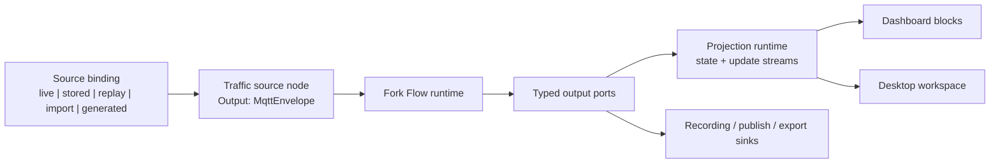

# Source-Agnostic Runtime And Update Plan

## Goal

FluxMQ must run the same behavior from online and offline data sources.

Live broker traffic, stored sessions, replay, imported data, generated data, and tests should feed the same workflows, projections, dashboards, and UI update paths. The downstream graph should not know where the message came from.

## Current Bottlenecks

### Live Path Lives In UI Code

`LiveMqttWorkspaceService` currently reads `IMqttSession.Messages`, updates the topic index, records messages, computes payload inspection, and notifies the UI.

That creates a second runtime beside Fork Flow. Anything built there must be rebuilt again for offline data, dashboard blocks, CLI, tests, and future hosts.

### Offline Path Is List-Based

Stored sessions are loaded through `IMessageRepository.GetBySession` into an in-memory list. That works for small alpha flows, but it is not the right runtime path for large sessions, dashboards, replay windows, or long-lived analysis.

### Dashboard Plan Has Two Execution Paths

The dashboard plan currently describes live mode over a running runtime and replay mode as a separate mini-pipeline. That would work, but it would hard-code the split we want to remove.

The dashboard should consume runtime/projection outputs. Source mode should be decided before the graph runs.

### EventHandler Is Too Weak For Runtime Updates

`EventHandler` has no completion, fault, backpressure, linking, unlinking, or graph semantics. It is acceptable as temporary UI glue, but it should not be the runtime update contract.

## Design Direction

### Source Mode Is An Execution Binding

The flow definition should describe a logical source node. The host binds that logical source to one concrete data source at run time:

- live MQTT broker
- stored session
- replay with timing
- replay as fast as possible
- imported file
- generated/test source

Downstream nodes keep the same links:

```json
{
  "inspect": {
    "type": "mqtt.payload-inspector",
    "Input": "traffic.Output"
  },
  "metrics": {
    "type": "mqtt.metrics-sink",
    "Input": "traffic.Output"
  }
}
```

Only the source binding changes.

### Dataflow Is The Public Runtime Contract

Public runtime/component/projection contracts should expose typed Dataflow surfaces:

- `ISourceBlock<T>` for update streams
- `ITargetBlock<T>` for inputs
- typed runtime ports for graph linking
- `ISourceBlock<FlowError>` for operational errors
- `ISourceBlock<StateChanged>` for lifecycle changes

Channels may remain inside low-level producers such as MQTT intake, but the conversion to Dataflow should happen once at the source adapter boundary.

### Projection State Is Durable; Dataflow Carries Updates

Dataflow streams are not durable state. A late UI subscriber should not depend on a `BroadcastBlock` replaying old messages.

Projection components should hold the current state and publish update streams:

```text
source stream
  -> runtime graph
  -> projection state
  -> snapshot/update stream
  -> UI
```

Examples:

- topic tree projection
- recent message projection
- selected payload projection
- metrics projection
- dashboard block projection

### Dashboard Consumes Projections, Not Source Modes

Dashboard blocks should bind to typed runtime ports or projection outputs.

The dashboard should not branch into live vs replay behavior. It should run over the active runtime/projection set. If the active source is live, dashboard updates live. If the active source is stored, dashboard updates from stored data.

## Target Update System



## Refactoring Plan

### Step 1 - Define Source Binding Shape

Status: implemented for the first alpha source modes.

`traffic.source` is now a registered runtime node type. Its `configuration.kind` selects the concrete source mode:

- `live`
- `stored-session`
- `generated`

Downstream nodes link to `traffic.Output` and do not need to know which mode produced the message.

Add a small execution-time model that can bind a logical source node to an online or offline source.

Do not create a large contract hierarchy yet. Start with the minimum needed to express:

- source name or typed source binding ID
- source kind
- configuration payload
- run mode options such as replay speed or as-fast-as-possible

### Step 2 - Add Streamed Stored Session Reads

Status: implemented.

Add streaming repository reads for stored messages:

```csharp
IAsyncEnumerable<MqttEnvelope> ReadEnvelopesBySessionAsync(...)
```

Keep `GetBySession` for UI lists and tests, but runtime execution should use streaming reads.

Add deterministic ordering for stored messages. `ReceivedAt` is not enough by itself because two messages can share the same timestamp. Add a per-session sequence field before relying on stored sessions for replay, dashboards, and repeatable tests.

### Step 3 - Create Source Components/Adapters

Status: implemented for live MQTT, stored sessions, and generated test data.

Introduce source implementations that all expose the same `MqttEnvelope` output shape:

- live MQTT source adapter
- stored session source adapter
- replay source adapter
- generated/test source adapter

The live adapter may read from a channel internally. The runtime sees a Dataflow source port.

### Step 4 - Move Workspace Updates Behind Projections

Status: started.

The desktop workspace now has a `WorkspaceMessageProjection` with durable snapshot state and Dataflow input/update surfaces. Live traffic and selected stored sessions both update the same projection path before the UI reads recent messages, selected payloads, and latest inspection state.

Replace direct UI-side message processing with projection components:

- topic tree projection
- recent messages projection
- payload inspection projection
- metrics projection

Each projection holds current state and exposes typed update streams.

The desktop app observes projections and renders state. It should not own broker reader loops for normal runtime behavior.

### Step 5 - Update Dashboard Design

Status: pending.

Revise dashboard runtime so dashboard blocks bind to projection outputs or typed runtime ports. Remove separate live/replay dashboard branches.

### Step 6 - Keep Temporary UI Glue Small

Status: in progress.

The MAUI Blazor UI may still need a local notification to call `StateHasChanged`. That glue should sit at the edge and must not become the data contract.

## Expected Result

After this refactor:

- Live and stored traffic use the same workflow behavior.
- Dashboards work online and offline without special branches.
- Topic tree, payload inspector, recent messages, metrics, and dashboard blocks use the same update model.
- Stored sessions can be processed without loading everything into memory.
- Runtime and tests can use deterministic source bindings.
- Channels remain available for hot producer internals without leaking into graph design.
- `EventHandler` stops shaping runtime architecture.

